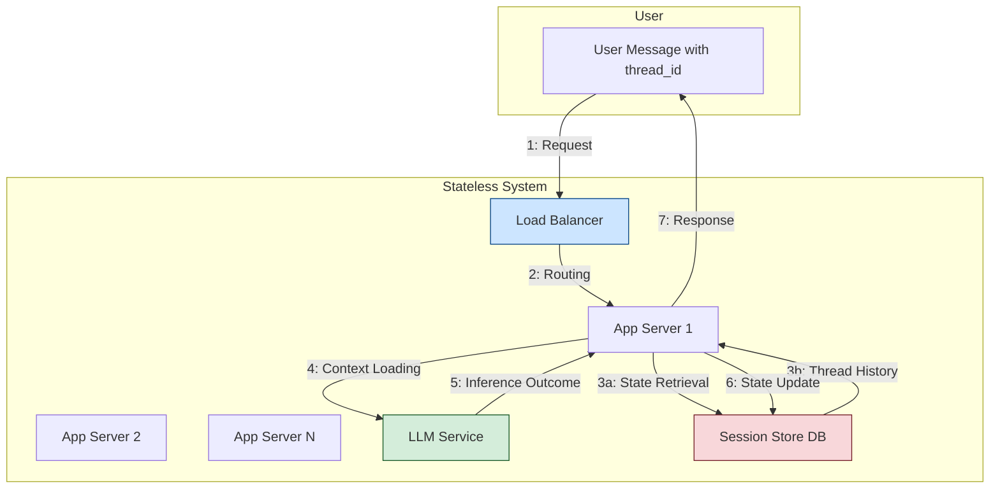
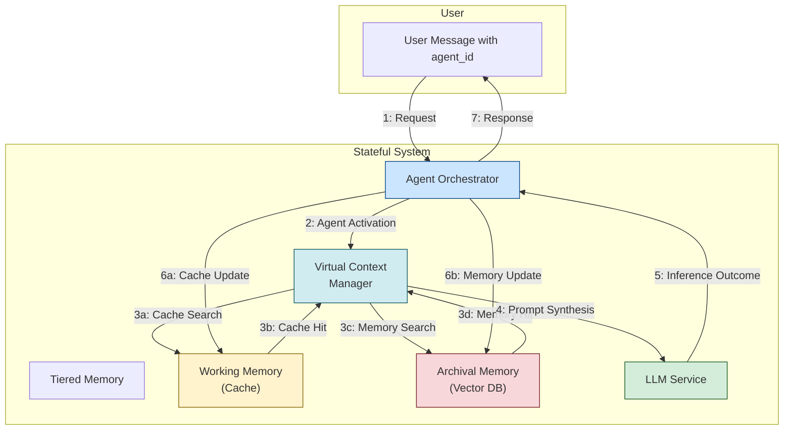
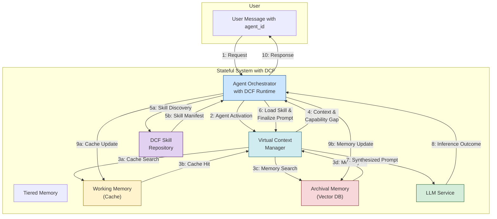
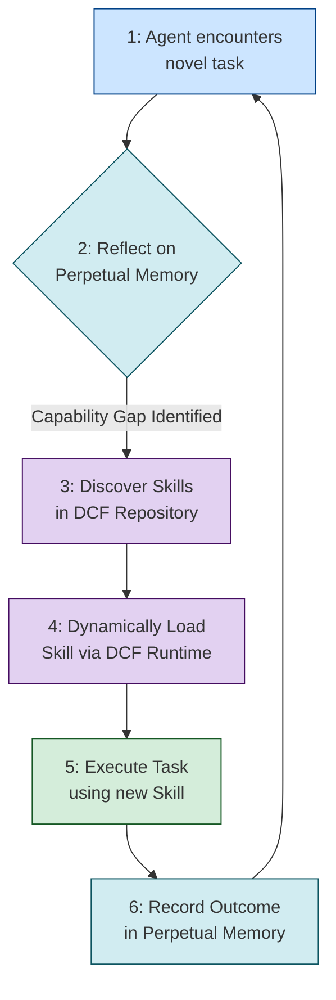

# DCF Patent Proposal

### **Title: A Novel System and Method for Dynamic Capability Management in Stateful, Perpetual-Memory Artificial Intelligence Agents**

### **Abstract**

This document describes a novel invention, the Dynamic Capabilities Framework (DCF), an Artificial Intelligence (AI) engineering system and method. DCF provides the essential architectural counterpart for enabling AI agents designed with perpetual memory to achieve true, continuous learning and autonomous adaptation. The core inventive step is a paradigm shift in modularity, moving from agent-centric specialization to a framework where fungible, foundational agents dynamically acquire and manage "transferable skills" at runtime. This approach overcomes critical limitations in current Agentic AI systems, which are analogous to a collection of amnesiac specialists, by enabling a new class of stateful agents that learn and evolve over time. DCF provides significant improvements in adaptability, reusability, maintainability, and operational efficiency, thereby enabling a more advanced and robust class of autonomous AI systems.

### **1. Background: State of the Art in Conventional Agentic AI System Design**

The contemporary field of Agentic AI is dominated by frameworks (e.g., Microsoft AutoGen, CrewAI, LangGraph) designed to orchestrate multiple AI agents to solve complex problems. The prevailing design principle in these systems is **agent-centric specialization**, where the `agent` itself is the primary unit of modularity and reuse.

**1.1. Architectural Pattern: The "Team of Experts"**

In this model, developers construct a multi-agent system by assembling a team of pre-defined, specialized agents. Each agent is designed with a specific role (e.g., a "Planner Agent," a "Coder Agent," a "QA Agent") and is equipped with a fixed set of tools and a specific persona or instruction set. Collaboration is achieved through structured conversations and handoffs between these specialized agents, much like a project team where each member has a fixed job title and skillset.

**1.2. System Implementation: Multi-Threaded and Stateless**

Architecturally, these systems are typically implemented following conventional distributed system patterns, which are fundamentally **stateless**. This can be analogized to a **fleet of amnesiac librarians**. Each librarian can fulfill any request, but for every single query, they must be handed the full context from scratch. They have no memory of the user they just spoke to or the request they just fulfilled.

- **Stateless Processing:** The application logic that hosts the agents is fundamentally stateless. Each interaction or "session" is treated as an independent, self-contained transaction.
- **Externalized State Management:** An agent's conversational history is maintained as a discrete "thread" or "session" stored in an external database (e.g., a Redis cache or document database). For each interaction, the entire relevant thread must be loaded into memory, processed by a Large Language Model (LLM), and then written back to the external store. The "librarian" must read the entire case file before they can act, and then files it away, forgetting everything.
- **Horizontal Scalability:** This stateless nature allows for high scalability by simply adding more processing nodes (more librarians), with a load balancer distributing requests among them.

***Process Flow of a Stateless Interaction:***

1. **Request Initiation:** A user sends a message to an existing conversation thread, identified by a `thread_id`.
2. **Routing:** A load balancer routes the incoming request to any available, interchangeable application server in a pool.
3. **State Retrieval:** The application server receives the `thread_id`, makes a call to the external session store, and retrieves the entire message history for that specific thread.
4. **Context Loading:** The full history is loaded into the server's local memory and formatted to fit into the LLM's context window.
5. **LLM Inference:** The context is sent to the LLM for processing, which generates a response.
6. **State Update:** The application server appends the new user message and the AI's response to the history and writes the entire updated thread back to the external session store.
7. **Response and Purge:** The response is sent back to the user, and the server purges all session data from its local memory, ready to handle a request from a completely different user and thread.

*Figure 1: Diagram of a conventional stateless interaction flow. State is externalized and loaded/purged for every request.*

**1.3. Inherent Technical Limitations**

While effective for well-defined, session-based tasks, this conventional approach presents significant technical barriers to creating truly autonomous and evolving AI:

- **Fragmented Knowledge:** The agent's "memory" is siloed within thousands of independent conversational threads. There is no unified, persistent memory. For example, a customer service agent wouldn't remember a user's previous frustrations from last week's thread, forcing the user to repeat themselves and leading to a poor experience.
- **Lack of True Adaptability:** An agent's capabilities are fixed at design time. It cannot acquire new abilities in response to novel challenges encountered during runtime. If a "Data Analyst" agent is asked to create a new type of visualization it wasn't designed for, it will simply fail.
- **Maintenance and Consistency Challenges:** In an enterprise environment, managing hundreds of specialized agents with overlapping functionalities creates a significant maintenance burden. If a core API changes, developers must hunt down and manually update every single specialized agent that uses it, a process ripe for introducing errors and inconsistencies.
- **Vendor Lock-in and Brittle Implementations:** The agent's logic is often tightly coupled to a specific LLM, making it difficult to adapt to new, more efficient models or switch vendors without a complete rewrite. This creates significant business risk in a rapidly evolving market.

### **2. The Emergence of Perpetual Memory Systems: A New Paradigm and a New Problem**

A novel and more advanced architectural pattern is emerging, exemplified by research systems like Letta AI (formerly MemGPT). These systems are designed to overcome the limitations of statelessness by building agents with **perpetual memory**.

**2.1. Architectural Pattern: The "Stateful Cognitive OS"**

This paradigm is best understood not as a web server, but as a **specialized Operating System (OS) for a cognitive entity**. It shifts from a stateless request-response model to a stateful, event-driven architecture where the agent is a long-running, persistent process.

- **Unitary, Infinite Memory:** Instead of fragmented threads, each agent possesses a single, continuous timeline of all its interactions. It can learn user preferences, recall distant facts, and maintain context over months or years, enabling a form of continuous, passive learning.
- **Continuous Learning:** This architecture allows an agent to access its entire life experience to inform its current decisions.

**2.2. System Implementation: Stateful and Memory-Centric**

The system implementation for this stateful paradigm is fundamentally different from its stateless counterpart. It revolves around active state management and a sophisticated memory hierarchy.

- **Stateful Agent Orchestrator:** At its core is a stateful service, the "kernel" of the Cognitive OS. This component actively manages the lifecycle of each agent, tracking whether it is "active" (in-memory) or "idle" (persisted) and orchestrating its access to memory and skills.
- **Tiered Memory System:** To manage an "infinite" memory without infinite cost, the system implements a memory hierarchy directly analogous to a computer's OS:
    - **Main Context (RAM):** The LLM's active, limited context window. Like a computer's RAM, it's incredibly fast but small and volatile.
    - **Working Memory (Cache):** A fast-access store for recent events, key facts, and summaries. This is where the agent keeps its "mental scratchpad" for quick recall.
    - **Archival Memory (Hard Drive):** The complete, unabridged history of the agent, stored in a durable vector database for efficient semantic retrieval. This is the agent's long-term memory.
- **Virtual Context Management:** The system employs an intelligent function that acts as a "memory management unit." For each interaction, it analyzes the incoming request, performs a relevance search on Archival Memory, and pulls from Working Memory to compose an optimal, condensed prompt that fits within the LLM's Main Context. This "paging" of memory is the key to providing a functionally infinite context.

***Process Flow of a Stateful Interaction:***

1. **Request Initiation:** A user sends a message, which is directed to the central **Agent Orchestrator**.
2. **Agent Activation:** The Orchestrator identifies the target agent by its persistent `agent_id` and "wakes it up," loading its **Working Memory (Cache)** into a ready state if it was idle.
3. **Virtual Context Construction:** The **Virtual Context Management** function is invoked. It analyzes the new message and performs a semantic search on the agent's **Archival Memory (Hard Drive)** to find the most relevant historical interactions, no matter how old.
4. **Prompt Synthesis:** This function intelligently synthesizes the new message, the retrieved archival memories, and the contents of Working Memory into a single, highly relevant, and compact prompt.
5. **LLM Inference:** This optimized prompt is passed to the LLM's **Main Context (RAM)** for processing. The LLM generates a response, potentially including self-directed instructions to update its memory.
6. **Memory Persistence:** The new interaction is appended to Archival Memory. Any new facts, summaries, or preferences are written to Working Memory for future fast access.
7. **Response and Idle State:** The response is sent to the user. After a period of inactivity, the Orchestrator can safely "page out" the agent, ensuring its complete state is durably persisted.

*Figure 2: Diagram of a stateful interaction flow. The Agent Orchestrator actively manages an agent's state using a tiered memory system to construct a virtualized context.*

**2.3. The Unsolved Technical Problem: The Capability Gap**

While perpetual memory systems solve the problem of *what* an agent can remember, they do not inherently solve the problem of *what* an agent can do. A perpetual memory agent can learn *from* its experience but lacks a native mechanism to **expand its procedural capabilities** based on that experience.

This is analogous to a person with a perfect memory who is incapable of learning new practical skills. They can remember reading a book about carpentry, but they cannot learn how to hold a hammer or saw wood. The agent can recognize a novel problem but has no way to autonomously acquire the tools or skills needed to solve it. This creates a critical "capability gap" that prevents these advanced agents from achieving true autonomy and evolution. **The existing art provides no systematic solution for dynamic, runtime capability acquisition and management for this new class of stateful agents.**

### **3. The Inventive Step: The Dynamic Capabilities Framework (DCF)**

The Dynamic Capabilities Framework (DCF) is the novel and non-obvious invention that solves the aforementioned capability gap. DCF provides the system, method, and architectural components to enable perpetual memory agents to autonomously manage and expand their skillset, thus completing the loop of learning, adaptation, and evolution.

**3.1. Core Inventive Concept: Shifting Modularity from Agents to "Transferable Skills"**

The foundational inventive step of DCF is to **redefine the primary unit of modularity in an Agentic AI system**. Instead of the "team of experts" model with specialized agents, DCF introduces a more flexible and powerful "single multi-specialist" model built on two core principles:

1. **Fungible Foundational Agents:** All agents are architecturally identical generalists. Their core function is to reason, learn from memory, and execute skills. They are blank slates, ready to become experts on demand.
2. **Transferable Skills as Modules:** The modular, reusable, and discoverable components are not the agents, but rather self-contained **"skills."** A skill is a formal, machine-readable definition of a specific capability (e.g., "query a customer database," "analyze a financial document," "generate a Python script").

**3.2. Technical Implementation of the Invention**

DCF is a complete system comprising several key technical components:

- **The Skill Manifest:** A novel data structure, typically a JSON or YAML file, that serves as the canonical definition of a skill. This manifest is version-controlled and contains a structured schema for:
    - **Tool Definitions:** Formal specifications for calling external functions, APIs, or microservices (akin to OpenAPI schemas or MCP).
    - **Memory Directives:** Instructions on how the skill interacts with the agent's perpetual memory blocks.
    - **RAG Data Sources:** Pointers to specific vector embeddings or knowledge bases required for the skill.
    - **Prompts:** System and user-level prompts that instruct the agent on how to correctly utilize the skill.
    - **Test Cases:** An embedded regression test to validate the skill's functionality against any LLM.
- **The DCF Toolkit:** A suite of software libraries and tools that provide:
    - A method for **composing, validating, and packaging** skill manifests into deployable artifacts.
    - A **Skill Repository** that serves as a centralized, searchable registry for all available skills.
    - An agent-facing API enabling an agent to **autonomously browse, discover, and semantically search** the repository for skills relevant to its current task.
- **The DCF Runtime Environment:** An execution environment for the agent that manages the **dynamic loading and unloading of skills**. It handles namespacing, dependency resolution, and isolates skills to allow an agent to flexibly compose a capability set. The **unloading mechanism** is a critical inventive feature for two key reasons:
    1. **Conflict Avoidance & Reliability:** By unloading skills after a task is complete, the runtime ensures the agent maintains a clean, minimal, and contextually relevant set of tools. This prevents potential errors arising from tool name collisions (e.g., two different skills defining a `generate_report` function) and reduces the LLM's burden of having to disambiguate between multiple, similar capabilities, thus increasing operational reliability.
    2. **Cognitive and Resource Efficiency:** Each loaded skill adds to the agent's "cognitive load" by expanding the set of actions it must consider, which in turn increases the size of the prompt sent to the LLM. Unloading skills not immediately relevant to the next task is a form of "cognitive garbage collection." This keeps the agent lean, reduces token consumption (cost), and improves performance by focusing the LLM on only the most pertinent capabilities.

**3.3. How DCF Solves the Technical Problem: The Synergistic Loop**

DCF directly enables a perpetual memory agent to bridge the capability gap, creating a synergistic loop of autonomous evolution. This process is illustrated in the architectural diagram (Figure 3) and the conceptual loop (Figure 4).

***Process Flow of a DCF-Enabled Stateful Interaction:***

1. **Request Initiation:** A user sends a message with a task to the central **Agent Orchestrator**.
2. **Agent Activation & Initial Context:** The Orchestrator activates the agent. The **Virtual Context Manager** retrieves relevant information from the agent's perpetual **Tiered Memory**.
3. **Capability Gap Identification:** During context synthesis, the agent's current task requirements are analyzed against its set of currently loaded skills. If the required procedural knowledge is absent or if memory indicates existing skills are unsuitable for the context, a **capability gap** is identified.
4. **Autonomous Skill Discovery:** The Agent Orchestrator, using the **DCF Toolkit**, initiates a semantic search of the **Skill Repository** for a skill manifest matching the required capabilities.
5. **Dynamic Skill Loading:** A suitable skill manifest is discovered. The **DCF Runtime Environment** validates the manifest and dynamically loads the new skill into the agent's active capability set for the current session.
6. **Final Prompt Synthesis:** The Virtual Context Manager finalizes the prompt for the LLM, now incorporating the instructions and tools defined in the newly loaded skill.
7. **LLM Inference:** The complete, capability-aware prompt is sent to the LLM Service for processing and execution.
8. **Memory Persistence:** The outcome of the task, including the identity and version of the skill used, is recorded in the agent's **Archival Memory**. This creates an experience log, linking the task type to the specific skill that solved it.
9. **Response:** The agent delivers the result to the user. Its capabilities are now enhanced, and its memory is updated with the new experience, ready for future, similar tasks.

*Figure 3: Diagram of the stateful system architecture enhanced with the DCF. The agent can now discover and load skills from the repository when a capability gap is identified.*

To illustrate this flow, consider a concrete example:

1. **Experience & Reflection:** An agent is asked to "Analyze the sentiment of our Japanese-language customer reviews." The agent queries its **perpetual memory** and finds it has a skill for sentiment analysis, but its memory log shows this skill has only ever succeeded on English text. It recognizes a procedural capability gap (Step 4 in Figure 2).
2. **Autonomous Skill Acquisition:** Using the **DCF Toolkit**, the agent queries the **Skill Repository** for skills with metadata tags like `sentiment-analysis` and `language:japanese` (Step 5).
3. **Dynamic Reconfiguration:** It discovers a `japanese_sentiment_analyzer_v1.2` skill and instructs the **DCF Runtime** to load it (Step 6). The agent's capabilities are now expanded in real-time.
4. **Execution and New Learning:** The agent executes the task using the new skill (Steps 7-8). The outcome of this execution—success or failure—is recorded as a new entry in its **perpetual memory**, linking the experience to the specific skill and its version (Step 9).

*Figure 4: A conceptual diagram of the core inventive loop enabled by DCF, transforming the agent from a static tool into a dynamic, learning entity.*

This loop—**Memory -> Reflection -> Discovery -> Reconfiguration -> Execution -> Memory**—is the unique technical effect enabled by combining a perpetual memory architecture with the DCF invention.

**3.4. Novelty and Industrial Applicability**

The DCF is a non-obvious and highly valuable invention that provides significant technical and commercial advantages, making advanced AI feasible for enterprise use:

- **True Adaptability & Future-Proofing:** Agents can adapt to new challenges without human intervention. The system is future-proof, as new skills can be developed and registered without altering the agent's core logic.
- **LLM Agnosticism and Cost Optimization:** By abstracting skills from models, DCF de-risks the business from vendor lock-in, API changes, or price hikes. The embedded test cases in skill manifests enable rapid, empirical testing of new models, allowing for the selection of the most cost-effective model for each specific skill.
- **Radical Reusability and Maintainability:** Skills that interface with enterprise systems (e.g., a "query_sap_inventory" skill) are defined once and reused by any agent. Updates are made to a single manifest, ensuring immediate, system-wide consistency and dramatically reducing maintenance overhead.
- **Enhanced Governance and Reliability:** Every capability is a version-controlled, auditable artifact, providing a level of governance and reliability that is unattainable with monolithic, specialized agent designs.

In summary, the Dynamic Capabilities Framework is a foundational invention that provides the missing link for creating truly autonomous, learning, and evolving AI agents. It shifts the paradigm of AI system design toward a more flexible, robust, and economically viable model, paving the way for the next generation of enterprise-grade Agentic AI.
