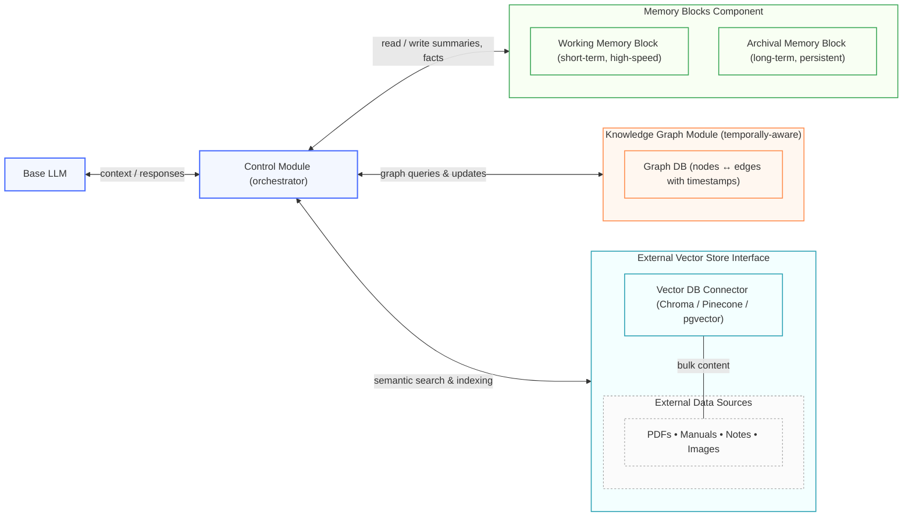
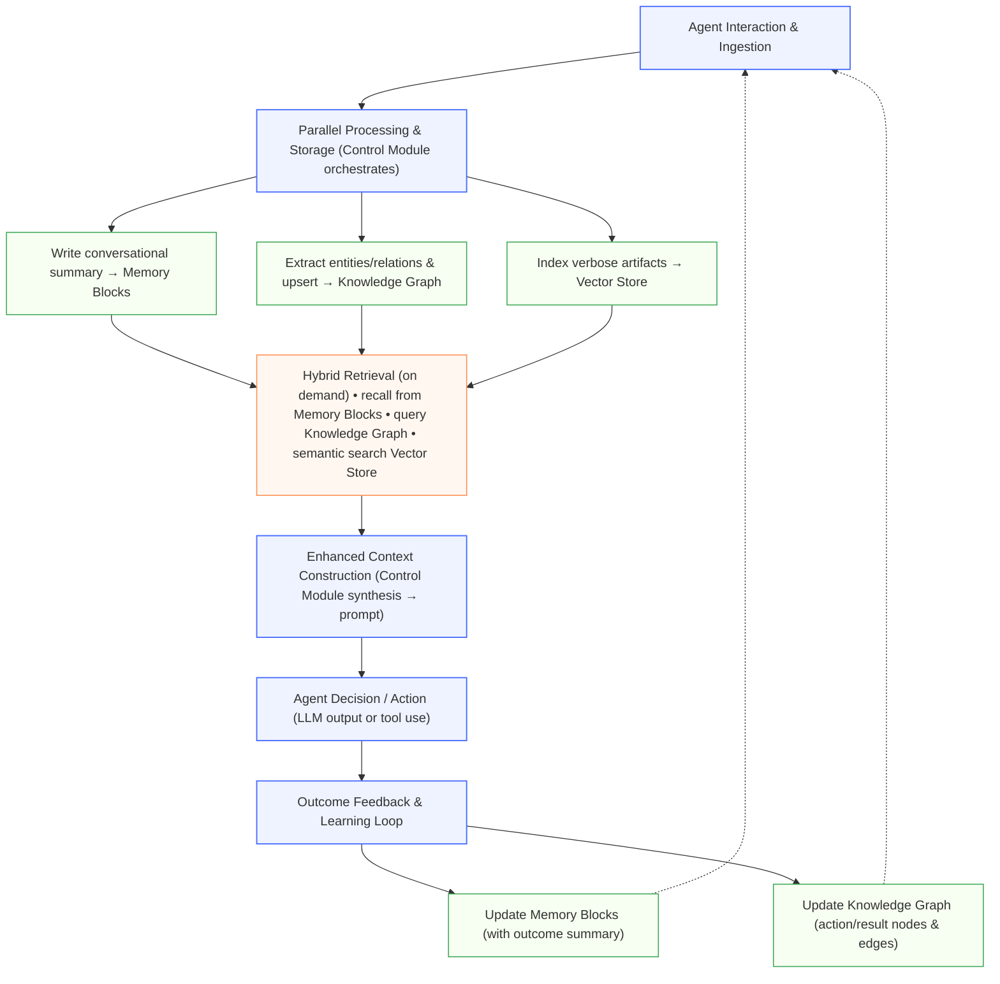

# Hybrid-Memory Patent Proposal

### **1. Title**

Hybrid Memory Layer for Autonomous AI Agents

### **2. Abstract**

A system, method, and agent for providing a hybrid memory layer in autonomous AI agents. The hybrid memory layer combines a knowledge graph, hierarchical memory blocks, and external vector stores to enable continuous learning, long- and short-term context recall, and efficient retrieval of detailed contextual data. The system supports dynamic agent evolution, strategic decision-making, and memory efficiency by intelligently routing information to the most appropriate storage and retrieval modality. This allows the agent to build a comprehensive and persistent understanding of its interactions and environment, improving its capabilities over time without needing to fine-tune its base Large Language Model (LLM).

### **3. Field of the Invention**

This invention relates to memory architectures in autonomous artificial intelligence agents, and more specifically to hybrid memory systems integrating graph-based, block-based, and vector-based memory modalities to create a persistent, adaptive, and efficient long-term memory.

### **4. Background of the Invention**

Autonomous AI agents require robust memory systems to learn from past interactions, maintain context over extended periods, and make informed decisions. Without a persistent and multifaceted memory, agents suffer from a form of "digital amnesia," limiting their ability to evolve or handle complex, multi-step tasks. Existing memory architectures, while powerful in specific contexts, present significant limitations when used in isolation.

The prior art includes several distinct approaches:

- **Embedding Techniques and Vector Stores:** A common approach, particularly in Retrieval-Augmented Generation (RAG) systems, is to use vector databases. Textual data is converted into numerical embeddings and stored for semantic similarity search. While effective for retrieving conceptually related documents or conversational snippets, this method has fundamental drawbacks for agentic memory. It fails to explicitly capture the relationships between pieces of information, such as causality or temporality. Furthermore, vector search alone cannot perform multi-hop reasoning or trace a logical path, and updating indexes can be inefficient.
- **Graph Databases and Knowledge Graphs:** Knowledge graphs represent information as a network of entities (nodes) and their relationships (edges). This structure is ideal for capturing complex connections, enabling multi-hop inference, and providing explainable reasoning paths. They serve as an excellent "source of truth" for an agent's structured knowledge. However, knowledge graphs are not optimized for storing and retrieving large, unstructured, or verbose textual content, such as entire documents or lengthy conversational logs.
- **Hierarchical Memory Blocks (e.g., Letta/MemGPT):** A more recent innovation is the concept of a hierarchical memory system, exemplified by research systems like Letta (formerly MemGPT). This approach uses "virtual context management" to teach an LLM to manage its own memory, moving information between a limited, active context window (working memory) and a larger, external archival memory. These "memory blocks" are excellent for maintaining long, coherent conversational flows and recalling specific facts from past interactions. Their primary limitation, however, is that they store context in a chronological or text-based manner, lacking the structured, relational query capabilities needed for complex inferential reasoning across disparate domains of knowledge.

Each of these technologies provides a piece of the memory puzzle. Vector stores answer "what feels related?", knowledge graphs answer "how is this connected?", and memory blocks answer "what was said before?". What is lacking in the art is an integrated, synergistic solution that combines these modalities to overcome their individual weaknesses, thereby creating a truly comprehensive and adaptive memory layer for autonomous agents.

### **5. Summary of the Invention**

The present invention provides a hybrid memory layer that overcomes the limitations of prior art by organically integrating three distinct memory modalities into a single, cohesive system.

**5.1 Core Concept**
The invention provides a hybrid memory layer for an autonomous AI agent that combines:

1. **A temporally-aware knowledge graph:** This serves as the agent's structured, long-term memory and reasoning engine. It stores entities, events, and their relationships, updating dynamically to reflect the agent's entire life experience. This enables the agent to perform complex, multi-hop reasoning and adapt its strategies based on historical outcomes.
2. **Hierarchical memory blocks:** Implemented via a framework like Letta, this component manages conversational context. It provides the agent with an effective working memory for immediate recall and an archival memory for perpetual conversational history, allowing it to remember specific facts and interactions with users over time.
3. **An external vector store interface:** This component is used to index and retrieve bulky, verbose data such as PDFs, technical documents, or lengthy notes. By offloading this content to an external store, the core memory system remains lean and efficient, fetching rich, detailed information on-demand via semantic search without cluttering the knowledge graph or memory blocks.

Together, these components provide a synergistic memory architecture where the structured reasoning of the knowledge graph, the chronological recall of memory blocks, and the semantic search of the vector store work in concert to provide a comprehensive and efficient memory layer.

**5.2 Advantages**
The integrated nature of this invention provides several key advantages:

- **Comprehensive Data Access:** The agent can fluidly draw upon structured relational data, unstructured verbose documents, and chronological conversational history to inform its decisions.
- **Efficient Resource Use:** By offloading bulky data to an external vector store, the agent's primary memory (the knowledge graph and memory blocks) remains performant and cost-effective.
- **Adaptive Continuous Learning:** The agent’s decisions and their outcomes are fed back into the knowledge graph and memory blocks. This creates a learning loop, allowing the agent to refine its strategies and autonomously improve its capabilities over time without requiring retraining or fine-tuning of the base LLM.
- **Improved Decision-Making:** By combining multiple memory and reasoning modalities, the agent can make more nuanced and well-informed decisions. It can recall a specific user preference from a memory block, reason about its implications using the knowledge graph, and retrieve a supporting document from the vector store, all within a single operational flow.

### **6. Detailed Description of the Invention**

**6.1 System Architecture**
The hybrid memory layer is comprised of several interconnected modules orchestrated by a central control module, as depicted in Figure 1.

- **Memory Blocks Component:** This module, which may be implemented using the Letta framework, is responsible for managing conversational and interactional memory. It is configured as a hierarchical system with a **working memory block** for short-term, high-speed recall and an **archival memory block** for long-term, persistent storage. These blocks can be labeled (e.g., "user_preferences," "agent_history") and configured with specific size limits and read/write permissions to ensure efficient and organized context management.
- **Knowledge Graph Module:** This module serves as the agent's core reasoning fabric. It consists of a graph database (e.g., implementing Zep's Graphiti over MCP SSE) that stores information as node-edge structures representing entities, concepts, events, and the relationships between them. This graph is **temporally-aware**, meaning relationships can be timestamped or carry properties indicating their validity over time. It is updated in real-time as the agent interacts with its environment, allowing it to build a dynamic, evolving model of its world for inferential reasoning.
- **External Vector Store Interface:** This is an interface, managed by the control module, that connects to one or more third-party vector databases (e.g. Chroma, Pinecone, pgvector, etc). It provides functions to index, embed, and search for verbose content such as PDF documents, markdown files, images, or extensive notes. This module ensures that the agent can access detailed, unstructured information without having to store such bulky data within its primary memory components.
- **Control Module:** This central processor orchestrates the entire system. It receives input, directs requests to the appropriate memory module(s), synthesizes the retrieved information, and constructs the final, enhanced context that is provided to the agent's base LLM for decision-making. It also manages the feedback loop, ensuring that new knowledge is written back to the appropriate memory stores.

*Figure 1: Overall System Architecture.*

**6.2 Operational Flow (Method)**
The method of the invention follows a cyclical operational flow, as illustrated in Figure 2, encompassing information ingestion, retrieval, decision-making, and learning.

1. **Interaction and Ingestion:** The agent receives an input, such as a user query or an observation from its environment.
2. **Parallel Processing and Storage:** The Control Module processes this input and stores facets of the information in parallel across the memory layers:
    - The direct conversational text is summarized and stored in the **Memory Blocks Component**, preserving the chronological context.
    - Key entities, facts, and relationships are extracted and used to update or create nodes and edges in the **Knowledge Graph Module**.
    - If the input involves or references a verbose document (e.g., "analyze this report"), the document is indexed and stored via the **External Vector Store Interface**.
3. **Hybrid Retrieval:** Upon needing to respond or act, the agent triggers a multi-modal recall process:
    - It queries the **Memory Blocks** to retrieve relevant recent or archived conversational facts.
    - It executes a query against the **Knowledge Graph** to extract structured context, understand relationships, and generate reasoning cues.
    - It performs a semantic search on the **Vector Store** to pull in rich, supporting content from external documents.
4. **Enhanced Context Construction and Decision:** The Control Module synthesizes the retrieved information from all sources into a cohesive, enriched context. This context is then used to arm the agent's LLM prompt, enabling it to make a highly-informed decision or generate a context-aware response without requiring model fine-tuning.
5. **Feedback and Learning Loop:** The outcome of the agent's decision or action is captured. This outcome is then processed and stored back into the **Knowledge Graph** (e.g., as a new node representing the action and its result) and **Memory Blocks**, closing the loop and allowing the agent to learn from its experience.

*Figure 2: Operational Flow.*

**6.3 Example Embodiment / Proof-of-Concept**
A proof-of-concept (PoC) of the invention was implemented using the **Letta** framework, which provides both the hierarchical memory blocks and API integrations for third-party vector stores. The knowledge graph component was implemented using **Zep's Graphiti**.

In an experimental use case, an agent was tasked with solving a complex technical support query.

- First, the agent used its **Letta memory blocks** to recall that the user had mentioned a specific error code in a conversation last week.
- Second, it queried the **Graphiti knowledge graph** with this error code. The graph returned a structured context showing that this error is frequently associated with "Component-A" but that previous attempts to fix it by "restarting" had a 70% failure rate, whereas "updating the firmware" had a 90% success rate.
- Third, the agent performed a semantic search via its **vector store interface** for the firmware update procedure for "Component-A," retrieving a detailed step-by-step guide from an indexed PDF manual.

By combining these three pieces of information—the conversational fact, the structured reasoning, and the detailed documentation—the agent was able to provide a precise, effective solution ("I see you're getting error XYZ again. The most effective solution is to update the firmware on Component-A, not restart it. Here are the steps..."). The success of this interaction was then written back to the knowledge graph, reinforcing the successful strategy. This demonstrates the cyclical learning and decision-making loop that is a core benefit of the invention.

### **7. Claims**

What is claimed is:

1. A computer-implemented method for providing a hybrid memory layer in an autonomous AI agent, comprising:
    - generating and storing structured factual information via a temporally-aware knowledge graph;
    - generating and storing conversational context in hierarchical memory blocks;
    - indexing verbose contextual information in an external vector store;
    - retrieving relevant information from at least two of: the knowledge graph, memory blocks, and vector store; and
    - constructing an enhanced agent context using the retrieved information for autonomous decision-making.
2. The method of claim 1, wherein the memory blocks include a short-term working memory block and a long-term archival memory block.
3. The method of claim 1 or 2, further comprising labelling and limiting memory blocks by size and read/write permissions.
4. The method of any preceding claim, wherein generating the knowledge graph comprises dynamically updating nodes and edges based on agent interactions.
5. The method of any preceding claim, further comprising loading verbose contextual information only from the external vector store, not storing it within the knowledge graph or memory blocks.
6. The method of any preceding claim, further comprising using agent decision outcomes to update both the knowledge graph and memory blocks continuously.
7. A system comprising:
    - a knowledge graph module;
    - a memory block module;
    - a vector store interface; and
    - a control module configured to perform the method of any one of claims 1–6.
8. A non-transitory computer-readable medium storing instructions that, when executed by a processor, cause the processor to perform the method of any one of claims 1–6.

### **8. Abstract of the Disclosure**

A system, method, and agent for providing a hybrid memory layer in autonomous AI agents. The hybrid memory layer combines a knowledge graph, hierarchical memory blocks, and external vector stores to enable continuous learning, long- and short-term context recall, and efficient retrieval of detailed contextual data. The system supports dynamic agent evolution, strategic decision-making, and memory efficiency by intelligently routing information to the most appropriate storage and retrieval modality. This allows the agent to build a comprehensive and persistent understanding of its interactions and environment, improving its capabilities over time without needing to fine-tune its base Large Language Model (LLM).

### **9. Drawings**

**Figure 1: System Architecture.** A block diagram illustrating the overall architecture of the invention. The diagram shows a central **Control Module** connected to the agent’s **base LLM**. The Control Module has data flow connections to three distinct sub-modules: the **Memory Blocks Component** (with internal **Working** and **Archival** blocks), the **Knowledge Graph Module**, and the **External Vector Store Interface**, which in turn connects to **external data sources**. Arrows indicate the flow of queries and retrieved data between the modules.

**Figure 2: Operational Flow.** A flowchart illustrating the cyclical method of the invention. The diagram begins with an **Agent Interaction** input, which leads to a **Parallel Processing & Storage** step. From there, data is written in parallel to the **Memory Blocks**, **Knowledge Graph**, and **Vector Store**. The process continues to a **Hybrid Retrieval** step, where data is read from all three sources. Retrieved information is then combined in an **Enhanced Context Construction** step, which leads to an **Agent Decision/Action**. Finally, an arrow shows the **Outcome Feedback** being written back to the **Knowledge Graph** and **Memory Blocks**, completing the learning loop.