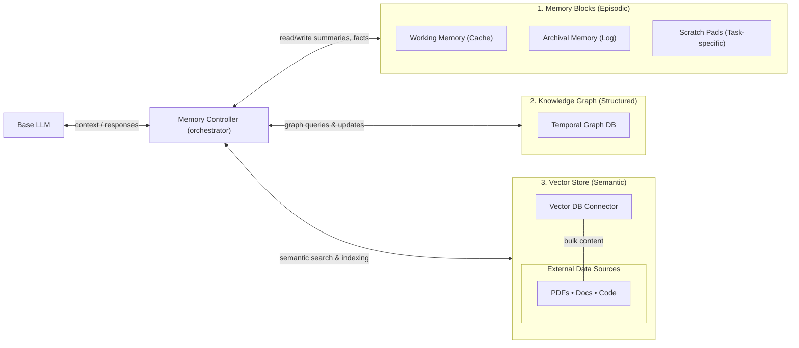
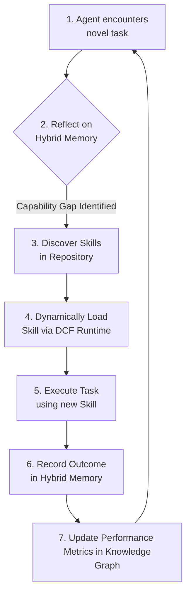

# Self-Evolving Agentic AI: A Unified Architecture for Dynamic Capabilities, Hybrid Memory, and Workflow Orchestration

### **Abstract**

This article presents a comprehensive architecture for creating autonomous AI agents that learn, adapt, and evolve through experience. We address the fundamental limitations of current agentic systems - fragmented knowledge and static capabilities - by unifying three core innovations: (1) a **Hybrid Memory System** that combines a temporally-aware knowledge graph, hierarchical memory blocks, and an external vector store for comprehensive context and structured reasoning; (2) a **Dynamic Capabilities Framework (DCF)** that shifts modularity from specialized agents to transferable, version-controlled "skills," enabling agents to acquire new abilities at runtime; and (3) a robust **Workflow Execution Engine** that uses AWS Step Functions (ASL) semantics to orchestrate complex tasks via ephemeral, choreography-driven worker agents. By integrating these components into the LettaPlus architecture, we create a self-evolving system where agents can reflect on their memory, identify capability gaps, autonomously acquire new skills, and execute complex workflows, feeding the results back into memory to continuously improve their performance. The system treats every engagement as an opportunity to refine institutional knowledge, transforming isolated problem-solving into cumulative organizational intelligence.

---

## 1. The Challenge: From Amnesiac Specialists to Evolving Generalists

The field of Agentic AI has rapidly progressed, with frameworks like AutoGen and LangGraph demonstrating the power of multi-agent collaboration. The dominant paradigm is the "team of experts," where specialized agents, each with a fixed role and toolset, are orchestrated to solve a problem.

However, this approach suffers from two critical architectural flaws that prevent true autonomy and learning:

1.  **Stateless, Amnesiac Design:** Most systems are fundamentally stateless. An agent's "memory" is typically confined to a single conversation thread, which must be loaded and re-processed with every interaction. This is akin to a fleet of amnesiac librarians who need the entire case file handed to them for every request, only to forget it immediately afterward. Knowledge is fragmented across thousands of isolated threads, preventing the agent from learning across interactions or developing a persistent understanding of its world.

2.  **Static, Pre-defined Capabilities:** The agent is the unit of modularity. Its skills are hard-coded at design time. A "Data Analyst" agent can't learn to create a new visualization type it wasn't explicitly built for. This leads to brittle systems that require constant manual updates and creates a significant maintenance burden as functionality overlaps and APIs change.

A new generation of **stateful agents**, exemplified by systems like Letta (formerly MemGPT), solves the memory problem. By treating the agent as a long-running process with a perpetual, tiered memory system, they can remember and recall information over their entire lifespan.

But this solves only half the problem. A stateful agent can remember what it has experienced, but it cannot inherently learn to *do* new things. It has a perfect memory of reading a carpentry book but no way to learn how to actually use a hammer.

**The vision of LettaPlus is to bridge this capability gap.** Rather than delivering isolated answers, autonomous agents should deliver end-to-end solutions. This requires more than a powerful language model; it demands a disciplined way to capture intent, design plans, execute tasks, and learn from the outcome. The architecture treats every engagement as an opportunity to refine institutional knowledge. Agents package their capabilities as reusable skills, stitch those skills into formal workflows, and preserve the results inside a layered memory fabric. Over time, the system behaves like an adaptive operations team that can compose best practices, collaborate safely, and evolve in response to new requirements.

---

## 2. The Agent's Mind: A Hybrid Memory System

To learn and evolve, an agent requires a memory that is more than just a conversational log. It needs a multifaceted system for different kinds of knowledge. We solve this by integrating three distinct memory modalities into a single, cohesive layer that maintains context across time.

### 2.1 The Three Pillars of Memory

Existing memory technologies, when used in isolation, are insufficient:
*   **Vector Stores** are excellent for semantic search ("what *feels* related?") but fail to capture causal or relational knowledge.
*   **Knowledge Graphs** excel at structured, multi-hop reasoning ("*how* is this connected?") but are ill-suited for storing verbose, unstructured text.
*   **Hierarchical Memory Blocks** (like in Letta) are perfect for chronological recall ("what was *said* before?") but lack structured query capabilities.

Our hybrid architecture combines these three pillars to create a comprehensive and efficient cognitive engine. Together, temporal knowledge graphs, hierarchical memory blocks, and external vector stores combine to capture structured facts, conversational nuance, and large source documents without overwhelming any single storage mechanism.

### 2.2 System Architecture

The hybrid memory layer is orchestrated by a central **Memory Controller** that intelligently routes information to the most appropriate storage and retrieval modality.



#### 2.2.1 Temporally-Aware Knowledge Graph

The knowledge graph is the agent's reasoning engine, storing entities, events, and relationships with temporal annotations. This allows the agent to reason about causality (what action led to what outcome), detect trends (skill performance improving or degrading over time), and maintain provenance. Graph edges can link workflows, skills, users, and results, supporting multi-hop queries such as "Which skill version succeeded most often for invoice reconciliation last quarter?" The graph becomes the institutional backbone that planners consult when drafting new workflows.

#### 2.2.2 Hierarchical Memory Blocks

Borrowing from Letta's architectural principles, memory blocks provide an explicit hierarchy:

*   **Working memory** keeps the most recent conversational turns, decision rationales, and short-term commitments close at hand, providing immediate recall.
*   **Long-term archival memory** stores the perpetual history of interactions, annotated with salience scores and timestamps.
*   **Task-specific scratch pads** hold intermediate computations or notes that should persist only for the lifetime of a workflow.

Agents can promote items between layers based on importance. For example, the outcome of a successful remediation workflow might graduate from working memory to the knowledge graph, while a partial calculation stays in scratch storage until the step completes. This design prevents context windows from ballooning while preserving critical facts indefinitely.

#### 2.2.3 External Vector Store Interface

Large documents—technical manuals, meeting transcripts, codebases—live in an external vector database like Chroma or Pinecone. When an agent needs detailed information, it issues semantic queries that retrieve the most relevant passages. The results are bundled into the agent's context alongside graph-derived facts and working-memory notes. By streaming only the necessary fragments, the system avoids overloading the base model yet still offers deep domain recall on demand.

### 2.3 Memory Orchestration and the Learning Loop

The memory controller coordinates ingestion and retrieval across modalities, enabling a continuous learning loop. When an agent interacts with the world:

1.  **Ingestion:** After each workflow step, the controller decides whether outputs should update the graph, append to archival logs, or enrich the vector store. The conversational text is summarized and stored in Memory Blocks. Key entities and relationships are extracted and used to update the Knowledge Graph. Referenced documents are indexed in the Vector Store.

2.  **Retrieval:** During planning, the controller assembles a "retrieval bundle" composed of salient diary entries, graph paths, and vector hits. To make a decision, the agent performs a **triangulated retrieval**, pulling recent conversational facts from memory blocks, strategic insights from the knowledge graph (e.g., "What has worked best for this kind of problem in the past?"), and supporting details from the vector store.

3.  **Synthesis:** The Memory Controller synthesizes this information into a rich, condensed context for the LLM, giving the planner a holistic view of prior art before proposing the next steps.

4.  **Feedback:** The outcome of the agent's action is fed back into the system. Logs capture context, decisions, tool invocations, and outcomes. Memory services update the knowledge graph with new edges (linked to the specific skill and version used), increment counters that measure reliability, and flag anomalies requiring human review. This closes the loop, allowing the agent to learn from its successes and failures while keeping memory coherent and ensuring that learning is cumulative rather than fragmented.

Over time, the repository transforms into a library of living Standard Operating Procedures (SOPs), each linked to the evidence that justifies its existence.

---

## 3. The Agent's Hands: The Dynamic Capabilities Framework (DCF)

A powerful memory is useless if the agent's ability to act is fixed. The Dynamic Capabilities Framework (DCF) solves this by redefining modularity in agentic systems and governing how skills are authored, distributed, and consumed.

### 3.1 From Specialized Agents to Transferable Skills

Instead of building a team of specialized agents, DCF proposes a system of **fungible, generalist agents** that can dynamically load and unload **"transferable skills."**

A **skill** is a self-contained, version-controlled, and machine-readable bundle of directives, tools, and contextual data that can be attached to any agent that satisfies the trust requirements. Skills encapsulate reusable know-how and provide the atomic building blocks for problem-solving. The skill - not the agent itself - is the primary unit of reuse.

### 3.2 The Skill Manifest Anatomy

The canonical definition of a skill is the **Skill Manifest**, a JSON file with a structured schema that supplies everything an agent needs to use the skill.

```jsonc
// Example Skill Manifest
{
  "manifestId": "web.search@1.0.0",
  "name": "web.search",
  "version": "1.0.0",
  "uuid": "550e8400-e29b-41d4-a716-446655440000",
  "aliases": ["internet_search", "web_lookup"],
  "author": "research_team",
  "lastUpdated": "2025-01-15T10:30:00Z",
  "tags": ["search", "research", "information_retrieval"],
  "description": "Performs web searches with quality filtering and rate limiting",
  
  "permissions": {
    "egress": "internet",
    "secrets": [],
    "riskLevel": "medium"
  },
  
  "directives": "Prefer high-quality sources from reputable domains. Rate-limit queries to avoid service degradation. Deduplicate URLs before returning results. Always cite sources with timestamps.",
  
  "requiredTools": [
    {
      "name": "web_search",
      "type": "mcp_endpoint",
      "serverId": "web.search.svc",
      "transport": "websocket",
      "args_schema": {
        "type": "object",
        "properties": {
          "q": {"type": "string", "description": "Search query"},
          "limit": {"type": "integer", "default": 10}
        },
        "required": ["q"]
      }
    }
  ],
  
  "dataSources": [
    {
      "name": "search_quality_guidelines",
      "type": "vector_collection",
      "uri": "vector://search-kb/quality-guidelines"
    }
  ],
  
  "tests": [
    {
      "input": {"q": "test query", "limit": 5},
      "expect": {"ok": true, "results_count_gte": 1}
    }
  ]
}
```

The manifest contains:
*   **Identity metadata:** Semantic version, UUID, aliases, authorship, and last-updated timestamps for traceability and version control.
*   **Directives:** Natural language prompts that inject domain-specific instructions, safety policies, or formatting requirements into the host agent's system prompt, guiding the agent on correct usage.
*   **Tool definitions:** Schemas for calling executable assets—native Letta tool handles, Python modules callable through a sandbox, or endpoints exposed by Model Context Protocol (MCP) servers.
*   **Data sources:** Pointers to documents or embeddings that preload into the agent's working memory so the skill starts with relevant context.
*   **Permissions and guardrails:** Security policies that declare the risks associated with the skill (egress access, secret requirements, risk level) and the checks a planner must satisfy before attachment.
*   **Embedded tests:** For validation and ensuring cross-model compatibility.

The schema enforces these elements, ensuring manifests stay machine readable and can be validated automatically. Because skills carry versioned identities, planners can reason about compatibility, roll back to previous releases, or run A/B comparisons.

### 3.3 Skill Lifecycle and Governance

Skill usage follows a strict lifecycle that keeps prompts lean, prevents capability drift, and produces a detailed activity log for later analysis:

1.  **Discovery:** Discovery tooling scans directories, verifies schema compliance, and surfaces warnings without interrupting planning.

2.  **Loading:** When a workflow requests a skill, the runtime loads it into the target agent, augmenting the system prompt, registering tools, and staging any packaged datasets. A dedicated memory block tracks which skills are active so subsequent loads can be deduplicated and auditable.

3.  **Execution:** The agent uses the skill's tools and directives to perform its task.

4.  **Unloading:** Once the step completes, the skill can be unloaded to return the agent to a clean baseline.

5.  **Feedback:** Each run records which skills were invoked, the parameters supplied, success or failure outcomes, latency statistics, and any human interventions. This execution metadata flows back into planning through the hybrid memory system.

### 3.4 The Capability Acquisition Loop

DCF enables an agent to autonomously expand its skillset, creating a synergistic loop that bridges the capability gap and transforms the agent from a static tool into a dynamic, learning entity.



When faced with a novel task, the agent uses its hybrid memory to recognize a capability gap. It then queries a **Skill Repository** to discover a suitable skill. The **DCF Runtime** loads this skill, temporarily expanding the agent's capabilities. After execution, the outcome - linked to the specific skill and version used - is recorded in memory. Hybrid memory absorbs this telemetry, linking skills to performance metrics inside the knowledge graph. Planners can then select skills based on proven effectiveness, retire underperforming ones, or trigger retraining workflows when the environment changes.

---

## 4. The Agent's Body: The Workflow Execution Engine

With a mind (Hybrid Memory) and hands (DCF), the agent needs a body to execute complex, multi-step tasks. Workflows translate intent into action by encoding state machines that agents can execute. Our runtime achieves this through a choreography-first model based on AWS Step Functions (ASL).

### 4.1 Workflows as Declarative JSON SOPs

A complex task is defined as a **workflow**, a JSON document that describes a state machine. This approach turns a complex process into a standardized, auditable, and reusable Standard Operating Procedure (SOP). Workflows define repeatable operating procedures - the steps required to solve a problem, the skills each step needs, and the sequencing logic that coordinates a team of workers.

LettaPlus adopts a JSON grammar inspired by AWS Step Functions. A workflow document contains:
*   **Top-level metadata:** Name, version, description, and import declarations for shared assets.
*   **An explicit starting state.**
*   **A map of named states:** Each state specifies its type (task, choice, parallel, map, or wait), transition targets, and any error-handling branches.
*   **AgentBinding for task states:** A custom field that links a task state to the agent template and skills required to execute it, selecting a worker template and listing the skills to load before execution.
*   **Optional agent pools:** Allow multiple workers to compete for the same step, improving resilience.

```jsonc
// Example Workflow Snippet (ASL + AgentBinding)
{
  "name": "research_and_summarize",
  "version": "1.0.0",
  "asl": {
    "StartAt": "Research",
    "States": {
      "Research": {
        "Type": "Task",
        "AgentBinding": {
          "agent_template_ref": "agent_template_worker@1.0.0",
          "skills": ["skill://web.search@1.0.0"],
          "agent_pool": "research_workers"
        },
        "ResultPath": "$.research_output",
        "Retry": [{
          "ErrorEquals": ["States.Timeout"],
          "MaxAttempts": 2
        }],
        "Next": "Summarize"
      },
      "Summarize": {
        "Type": "Task",
        "AgentBinding": {
          "agent_template_ref": "agent_template_worker@1.0.0",
          "skills": ["skill://summarize@1.0.0"]
        },
        "InputPath": "$.research_output",
        "End": true
      }
    }
  }
}
```

### 4.2 The Planning Process

The workflow begins with a **Planner Agent** that conducts an interactive conversation to clarify user goals, available resources, and success criteria. It surveys the skill catalog, proposes candidate steps, and iteratively refines them into a linear standard operating procedure. The SOP is then compiled into the workflow schema, complete with state transitions, retry policies, and data passing rules.

Validation checks ensure the JSON conforms to the schema, resolve relative imports, and confirm that every branch leads to a terminal state. Only after the plan passes these gates is it submitted for user approval or persisted as a reusable asset.

### 4.3 Choreography and the Redis Control Plane

Instead of relying on a monolithic orchestrator, our system uses **choreography**. The workflow is executed by a team of **ephemeral worker agents**, each instantiated just-in-time for a specific task. Rather than a central scheduler, LettaPlus uses a Redis-backed control plane to coordinate work.

When a workflow is instantiated, the control plane materializes a document that tracks:
*   **Workflow metadata:** Definition, version, initiator.
*   **Per-state status:** Pending, running, done, failed.
*   **Dependencies:** Which states must complete before others can start.
*   **Input payloads and output slots:** Data passing between states.
*   **Current agent assignments:** Which worker is handling which task.

This space contains:
*   A **meta document** defining the workflow's dependency graph.
*   A **state document** for each task, tracking its status, attempts, and errors.
*   A **data plane** for passing outputs between tasks.

### 4.4 Worker Lifecycle and Soft Leases

Workers are ephemeral agents derived from reusable `.af v2` templates. The execution flow is as follows:

1.  **Provisioning:** Provisioning tooling clones the template, applies any workflow-specific configuration, and records the worker in the control plane.

2.  **Task Acquisition:** Workers poll the control plane for ready states and acquire leases with time-to-live guarantees. To prevent race conditions, workers use a **soft lease** system. Before starting a task, a worker acquires a lease in the state document, ensuring that even if multiple workers are available, only one can execute the task at a time.

3.  **Execution:** When a worker claims a task, it loads the required skills (the runtime augments the system prompt, registers tools, and stages datasets), executes the step using the registered tools, and captures structured outputs.

4.  **Completion:** The worker writes back status updates, unloads the skills to return to the base prompt, and releases the lease. Structured outputs are stored alongside status metadata, allowing downstream agents to consume results programmatically. Completion triggers downstream states by updating dependency counters inside Redis.

5.  **Fault Tolerance:** If a worker crashes or exceeds its lease, another agent can take over without duplicating work. This choreography-first approach allows multiple agents to collaborate without central coordination while still maintaining a consistent audit trail.

6.  **Finalization:** Once the entire workflow finishes, finalization routines close any lingering leases, record summary metrics, and optionally delete temporary workers after their logs are archived to the hybrid memory system.

---

## 5. Multi-Agent Collaboration Protocols

LettaPlus supports teams of agents working in parallel, transforming isolated problem-solving into collaborative work. The control plane exposes a subscription model so observers can react to state changes:

*   **Reviewers** can inspect pending approvals.
*   **Remediation agents** can jump in when retries exceed thresholds.
*   **Graph curators** can annotate significant events.

Because every worker adheres to the same skill-loading conventions and memory policies, agents can hand off tasks without losing context. Structured outputs, stored alongside status metadata, allow downstream agents to consume results programmatically rather than parsing free-form text. This collaborative substrate makes it feasible to compose specialized agents into ad hoc teams tailored to each workflow.

---

## 6. Knowledge Promotion and Continuous Improvement

Every workflow run produces data that can improve future performance, transforming the system from a task executor into a learning organization. The feedback loop operates as follows:

1.  **Capture:** Logs capture context, decisions, tool invocations, and outcomes for each workflow execution.

2.  **Distillation:** Post-run reflection distills these artifacts into structured insights: success metrics, failure causes, remediation steps, and recommendations.

3.  **Promotion:** Approved workflows are versioned and published to catalogs with descriptive metadata so planners can discover and reuse them. High-performing runs can be elevated into shared catalogs, subject to governance rules.

4.  **Memory Update:** Memory services update the knowledge graph with new edges, increment counters that measure reliability, and flag anomalies requiring human review.

5.  **Adaptive Selection:** Planners leverage knowledge-graph analytics to recommend alternative skills when performance dips, and the system can automatically route sensitive tasks through approved workflows based on policy constraints encoded in manifests.

Over time, the repository transforms into a library of living SOPs, each linked to the evidence that justifies its existence. The system moves closer to truly autonomous operations, where each run strengthens the institution's collective intelligence.

---

## 7. Tooling and Operational Safeguards

The repository ships with utilities that make the system practical to operate, transforming theoretical concepts into production-ready infrastructure:

*   **Schema validators** ensure that skill manifests, workflows, and notification payloads comply with their contracts before deployment.
*   **Skill discovery and loading tools** automate catalog management and enforce guardrails during runtime attachment.
*   **Control-plane initializers** create Redis documents, seed dependency graphs, and configure worker pools.
*   **Lease managers** monitor heartbeat intervals, extend or revoke leases, and trigger retries when tasks stall.
*   **Finalization scripts** close workflows, archive logs, and clean up temporary agents once outputs are secured.

All tools emit structured `{ok, status, error}` responses so planners and workers can chain them together within tool-calling conversations. This uniform interface simplifies error handling and keeps agent prompts concise, enabling reliable automation without sacrificing debuggability.

---

## 8. Roadmap and Future Directions

The current architecture lays the foundation for self-evolving agents, but several enhancements remain on the horizon to create a truly autonomous control layer:

*   **Policy Service:** A contextual bandit that learns the optimal skill or workflow to use for a given task based on historical performance data stored in the knowledge graph.

*   **Automated Workflow Promotion:** A "Reflector" agent that analyzes successful ad-hoc task executions and nominates them to become standardized, version-controlled workflows, elevating high-performing runs into shared catalogs without human intervention (subject to governance rules).

*   **Adaptive Skill Selection:** Leverage knowledge-graph analytics to recommend alternative skills when performance dips, helping teams decide when to refactor, retire, or branch SOPs.

*   **Safe Rollout and A/B Testing:** An A/B routing mechanism to safely deploy new workflows and policies, automatically rolling back on performance regressions. Temporal analytics can compare workflow variants across time.

*   **Policy-Aware Planning:** Manifests encode compliance constraints, and planners automatically route sensitive tasks through approved workflows based on policy requirements.

*   **Cross-Agent Knowledge Synchronization:** A publish/subscribe model for agents to share newly validated skills and improved workflows, accelerating learning across the entire system.

*   **Proactive Memory Hygiene:** Audit vector stores and archival logs for stale or conflicting information, maintaining a trustworthy knowledge base.

By uniting skills, workflows, and hybrid memory under a coherent governance model, LettaPlus delivers an agent platform that not only executes complex tasks but also learns from every engagement. By closing these final loops, we move toward a future where AI systems do not just execute tasks, but actively manage and improve the processes themselves, creating a virtuous cycle of ever-increasing autonomy and intelligence. The system transforms from a collection of LLM calls into a deliberate planning-and-execution loop that accumulates organizational intelligence over time.

---

## 9. Conclusion

The architecture presented here lays the foundation for a truly self-evolving AI ecosystem. By unifying a Hybrid Memory System, a Dynamic Capabilities Framework, and a choreography-based Workflow Engine, we have created a holistic architecture for agents that truly learn and evolve.

This system transforms Agentic AI from a collection of static, specialized tools into a dynamic, self-improving workforce. Each successful task execution can be promoted into a version-controlled workflow. Each interaction enriches the agent's memory, improving its future decision-making. Each new challenge can be met by discovering and acquiring new skills.

The immediate benefits are clear:
*   **Radical reusability** through transferable skills rather than specialized agents.
*   **Enhanced governance** through version-controlled artifacts and audit trails.
*   **Genuine adaptability** through autonomous capability acquisition.
*   **Cumulative learning** through comprehensive memory orchestration.

However, the most exciting implications lie in the emergent capabilities this system enables. This architecture provides a practical roadmap for building the next generation of enterprise-grade AI: systems that are not only powerful but also adaptable, governable, and capable of accumulating organizational intelligence over time. Planners design workflows, workers execute them with skills loaded on demand, and memory services consolidate what happened so the next plan can be smarter. Over time, the system behaves like an adaptive operations team that can compose best practices, collaborate safely, and evolve in response to new requirements—delivering not just answers, but end-to-end solutions.