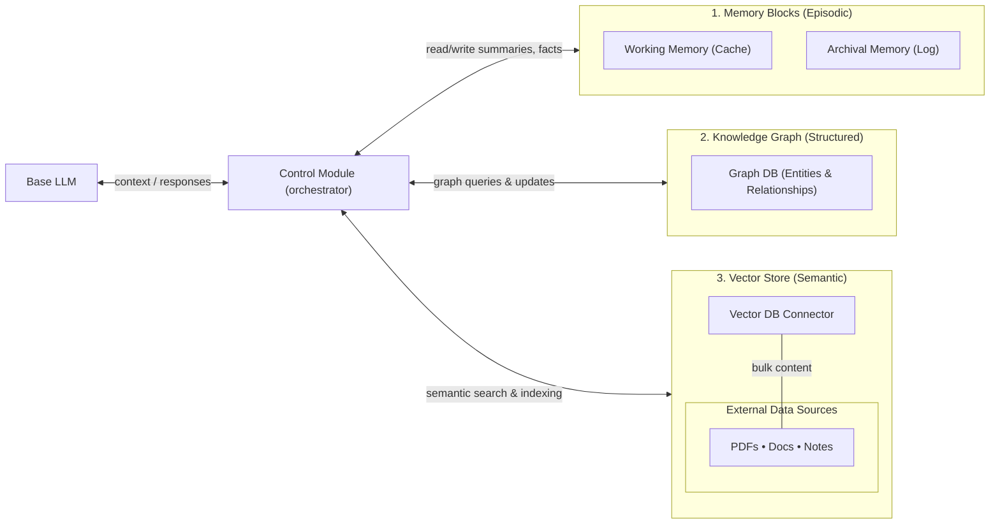
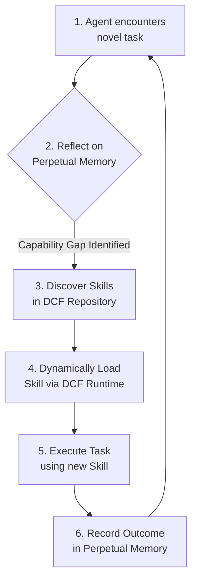

# Toward Self‑Evolving Agentic AI: A Unified Architecture for Skill‑Based Workflows and Hybrid Memory

### **Abstract**

This article presents a novel, end-to-end architecture for creating autonomous AI agents that learn, adapt, and evolve through experience. We address the fundamental limitations of current agentic systems—fragmented knowledge and static capabilities—by unifying three core innovations: (1) a **Hybrid Memory System** that combines a temporally-aware knowledge graph, hierarchical memory blocks, and an external vector store for comprehensive context and structured reasoning; (2) a **Dynamic Capabilities Framework (DCF)** that shifts modularity from specialized agents to transferable, version-controlled "skills," enabling agents to acquire new abilities at runtime; and (3) a robust **Workflow Execution Engine** that uses AWS Step Functions (ASL) semantics to orchestrate complex tasks via ephemeral, choreography-driven worker agents. By integrating these components, we create a self-evolving system where agents can reflect on their memory, identify capability gaps, autonomously acquire new skills, and execute complex workflows, feeding the results back into memory to continuously improve their performance.

---

## 1. The Challenge: From Amnesiac Specialists to Evolving Generalists

The field of Agentic AI has rapidly progressed, with frameworks like AutoGen and LangGraph demonstrating the power of multi-agent collaboration. The dominant paradigm is the "team of experts," where specialized agents, each with a fixed role and toolset, are orchestrated to solve a problem.

However, this approach suffers from two critical architectural flaws that prevent true autonomy and learning:

1.  **Stateless, Amnesiac Design:** Most systems are fundamentally stateless. An agent's "memory" is typically confined to a single conversation thread, which must be loaded and re-processed with every interaction. This is akin to a fleet of amnesiac librarians who need the entire case file handed to them for every request, only to forget it immediately afterward. Knowledge is fragmented across thousands of isolated threads, preventing the agent from learning across interactions or developing a persistent understanding of its world.

2.  **Static, Pre-defined Capabilities:** The agent is the unit of modularity. Its skills are hard-coded at design time. A "Data Analyst" agent can't learn to create a new visualization type it wasn't explicitly built for. This leads to brittle systems that require constant manual updates and creates a significant maintenance burden as functionality overlaps and APIs change.

A new generation of **stateful agents**, exemplified by systems like Letta (formerly MemGPT), solves the memory problem. By treating the agent as a long-running process with a perpetual, tiered memory system, they can remember and recall information over their entire lifespan.

But this solves only half the problem. A stateful agent can remember what it has experienced, but it cannot inherently learn to *do* new things. It has a perfect memory of reading a carpentry book but no way to learn how to actually use a hammer. This "capability gap" is the final barrier to creating truly autonomous, evolving AI.

This article details a unified architecture that bridges this gap, combining a sophisticated memory system with a framework for dynamic skill acquisition and a robust engine for executing complex tasks.

---

## 2. The Agent's Mind: A Hybrid Memory System

To learn and evolve, an agent requires a memory that is more than just a conversational log. It needs a multifaceted system for different kinds of knowledge. We solve this by integrating three distinct memory modalities into a single, cohesive layer.

### 2.1 The Three Pillars of Memory

Existing memory technologies, when used in isolation, are insufficient:
*   **Vector Stores** are excellent for semantic search ("what *feels* related?") but fail to capture causal or relational knowledge.
*   **Knowledge Graphs** excel at structured, multi-hop reasoning ("*how* is this connected?") but are ill-suited for storing verbose, unstructured text.
*   **Hierarchical Memory Blocks** (like in Letta) are perfect for chronological recall ("what was *said* before?") but lack structured query capabilities.

Our hybrid architecture combines these three pillars to create a comprehensive and efficient cognitive engine.

### 2.2 System Architecture

The hybrid memory layer is orchestrated by a central **Control Module** that intelligently routes information to the most appropriate storage and retrieval modality.



1.  **Temporally-Aware Knowledge Graph:** This is the agent's reasoning engine, storing entities, events, and their relationships with timestamps and performance metadata (e.g., success rates, latencies). It allows the agent to ask: "What has worked best for this kind of problem in the past?"
2.  **Hierarchical Memory Blocks:** Using a framework like Letta, this component manages conversational context. A `working memory` provides immediate recall, while an `archival memory` stores the perpetual history of interactions.
3.  **External Vector Store Interface:** This offloads bulky, verbose data (PDFs, technical documents) to an external store like Chroma or Pinecone. The agent can retrieve rich, detailed information via semantic search without cluttering its core memory.

### 2.3 The Learning Loop in Memory

This hybrid system enables a continuous learning loop. When an agent interacts with the world:
1.  **Ingestion:** The conversational text is summarized and stored in the Memory Blocks. Key entities and relationships are extracted and used to update the Knowledge Graph. Referenced documents are indexed in the Vector Store.
2.  **Retrieval:** To make a decision, the agent performs a **triangulated retrieval**, pulling recent conversational facts from memory blocks, strategic insights from the knowledge graph, and supporting details from the vector store.
3.  **Synthesis:** The Control Module synthesizes this information into a rich, condensed context for the LLM.
4.  **Feedback:** The outcome of the agent's action is fed back into the system, updating the Knowledge Graph with new performance data and creating new entries in the memory blocks. This closes the loop, allowing the agent to learn from its successes and failures.

---

## 3. The Agent's Hands: The Dynamic Capabilities Framework (DCF)

A powerful memory is useless if the agent's ability to act is fixed. The Dynamic Capabilities Framework (DCF) solves this by redefining modularity in agentic systems.

### 3.1 From Specialized Agents to Transferable Skills

Instead of building a team of specialized agents, DCF proposes a system of **fungible, generalist agents** that can dynamically load and unload **"transferable skills."**

A **skill** is a self-contained, version-controlled, and machine-readable definition of a capability. It is the primary unit of reuse, not the agent itself.

### 3.2 The Skill Manifest

The canonical definition of a skill is the **Skill Manifest**, a JSON file with a structured schema.

```jsonc
// Appendix B — Example Skill Manifest (Essentials)
{
  "manifestId": "web.search@1.0.0",
  "name": "web.search",
  "version": "1.0.0",
  "tags": ["search", "research"],
  "permissions": {"egress": "internet", "secrets": []},
  "directives": "Prefer high‑quality sources; rate‑limit queries; deduplicate URLs.",
  "requiredTools": [
    {
      "name": "web_search",
      "serverId": "web.search.svc",
      "transport": "websocket",
      "args_schema": {"type": "object", "properties": {"q": {"type": "string"}}}
    }
  ],
  "tests": [{"input": {"q": "test"}, "expect": {"ok": true}}]
}
```
The manifest contains everything an agent needs to use the skill:
*   **Metadata:** Version, description, tags for discovery.
*   **Tool Definitions:** Schemas for calling external functions, APIs, or microservices.
*   **Directives:** Natural language prompts guiding the agent on correct usage.
*   **Data Sources:** Pointers to required RAG knowledge bases.
*   **Permissions:** Security policies for egress and secret access.
*   **Embedded Tests:** For validation and ensuring cross-model compatibility.

### 3.3 The Capability Acquisition Loop

DCF enables an agent to autonomously expand its skillset, creating a synergistic loop that bridges the capability gap.



When faced with a novel task, the agent uses its hybrid memory to recognize a capability gap. It then queries a **Skill Repository** to discover a suitable skill. The **DCF Runtime** loads this skill, temporarily expanding the agent's capabilities. After execution, the outcome—linked to the specific skill and version used—is recorded in memory. This transforms the agent from a static tool into a dynamic, learning entity.

---

## 4. The Agent's Body: The Workflow & Skills Runtime

With a mind (Hybrid Memory) and hands (DCF), the agent needs a body to execute complex, multi-step tasks. Our runtime achieves this through a choreography-first model based on AWS Step Functions (ASL).

### 4.1 Workflows as JSON SOPs

A complex task is defined as a **workflow**, a JSON document that describes a state machine. This approach turns a complex process into a standardized, auditable, and reusable Standard Operating Procedure (SOP).

The schema combines a subset of ASL with a custom `AgentBinding` field, which links a task state to the agent template and skills required to execute it.

```jsonc
// Appendix A — Example Workflow Snippet (ASL + AgentBinding)
{
  "asl": {
    "StartAt": "Research",
    "States": {
      "Research": {
        "Type": "Task",
        "AgentBinding": {
          "agent_template_ref": "agent_template_worker@1.0.0",
          "skills": ["skill://web.search@1.0.0"]
        },
        "Next": "Summarize"
      },
      "Summarize": {
        "Type": "Task",
        "AgentBinding": {
          "agent_template_ref": "agent_template_worker@1.0.0",
          "skills": ["skill://summarize@1.0.0"]
        },
        "End": true
      }
    }
  }
}
```

### 4.2 Choreography and Ephemeral Workers

Instead of a central orchestrator, our system uses **choreography**. The workflow is executed by a team of **ephemeral worker agents**, each instantiated just-in-time for a specific task.

Collaboration is managed through a **RedisJSON control plane**. This space contains:
*   A **meta document** defining the workflow's dependency graph.
*   A **state document** for each task, tracking its status (`pending`, `running`, `done`), attempts, and errors.
*   A **data plane** for passing outputs between tasks.

To prevent race conditions, workers use a **soft lease** system. Before starting a task, a worker acquires a lease in the state document. This ensures that even if multiple workers are available, only one can execute the task at a time. If a worker dies, the lease expires, and another can take over.

The execution flow is as follows:
1.  A **Planner Agent** compiles the user's intent into a workflow JSON.
2.  The control plane is seeded, and worker agents are created from a shared template.
3.  The Planner notifies the first worker(s).
4.  A worker acquires a lease, loads the skills specified in its `AgentBinding`, performs its task, writes its output, releases the lease, and notifies the downstream workers.
5.  This continues until the final state is reached. The worker agents are then destroyed, leaving the control and data planes as a permanent audit trail.

---

## 6. Summary

By unifying a Hybrid Memory System, a Dynamic Capabilities Framework, and a choreography-based Workflow Engine, we have created a holistic architecture for agents that truly learn and evolve. This system transforms Agentic AI from a collection of static, specialized tools into a dynamic, self-improving workforce. Each successful task execution can be promoted into a version-controlled workflow. Each interaction enriches the agent's memory, improving its future decision-making. Each new challenge can be met by discovering and acquiring new skills. This architecture provides a practical roadmap for building the next generation of enterprise-grade AI: systems that are not only powerful but also adaptable, governable, and capable of accumulating organizational intelligence over time.

## 7. Conclusion and Future Work

The architecture presented here lays the foundation for a truly self-evolving AI ecosystem. The immediate benefits are clear: radical reusability, enhanced governance through version-controlled artifacts, and genuine adaptability. However, the most exciting implications lie in the emergent capabilities this system enables.

The next phase of this work will focus on building a **Self-Evolving Control Layer** on top of this architecture. This includes:
*   **A Policy Service:** A contextual bandit that learns the optimal skill or workflow to use for a given task based on historical performance data stored in the knowledge graph.
*   **Automated SOP Promotion:** A "Reflector" agent that analyzes successful ad-hoc task executions and nominates them to become standardized, version-controlled workflows.
*   **Safe Rollout and A/B Testing:** An A/B routing mechanism to safely deploy new workflows and policies, automatically rolling back on performance regressions.
*   **Cross-Agent Knowledge Synchronization:** A publish/subscribe model for agents to share newly validated skills and improved workflows, accelerating learning across the entire system.

By closing these final loops, we move toward a future where AI systems do not just execute tasks, but actively manage and improve the processes themselves, creating a virtuous cycle of ever-increasing autonomy and intelligence.