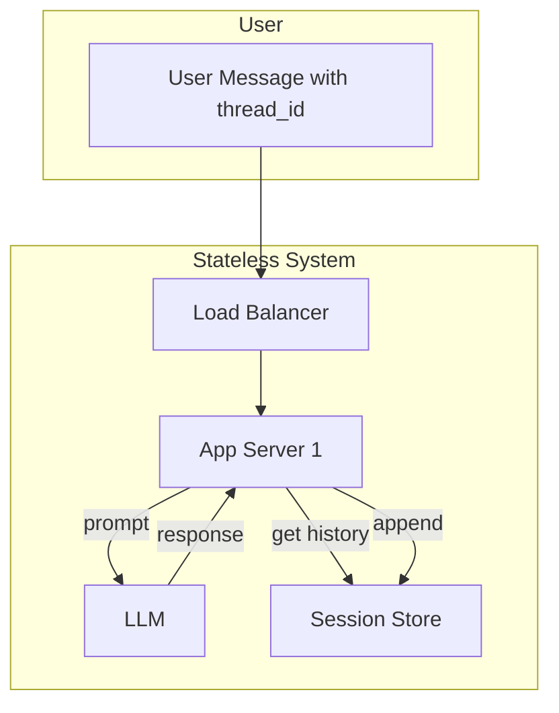
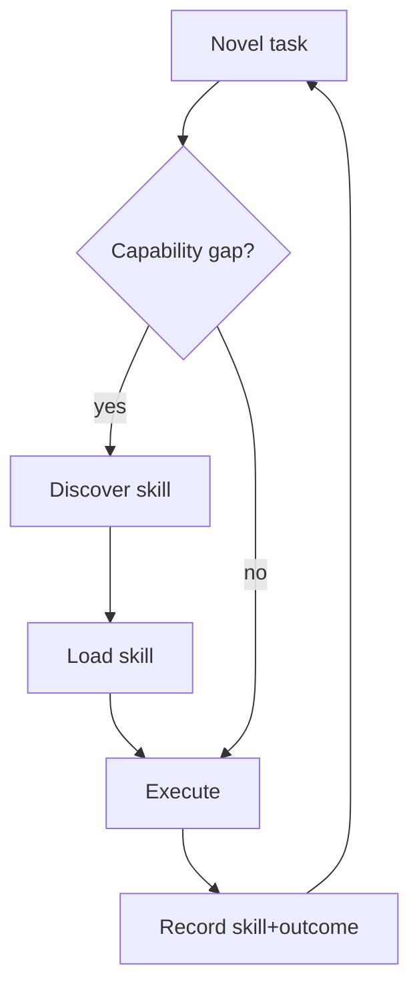
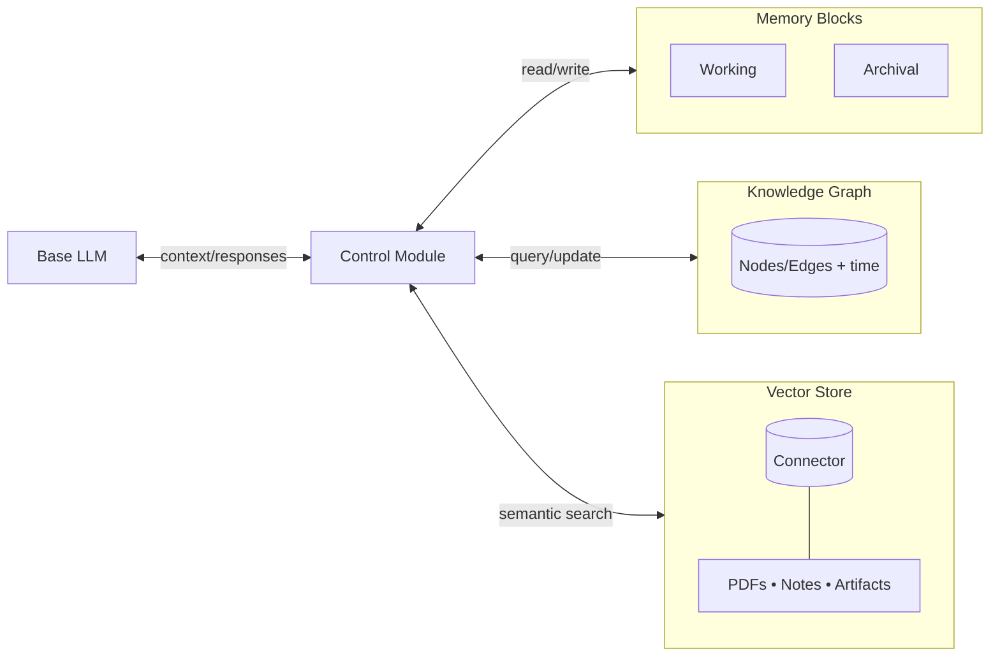
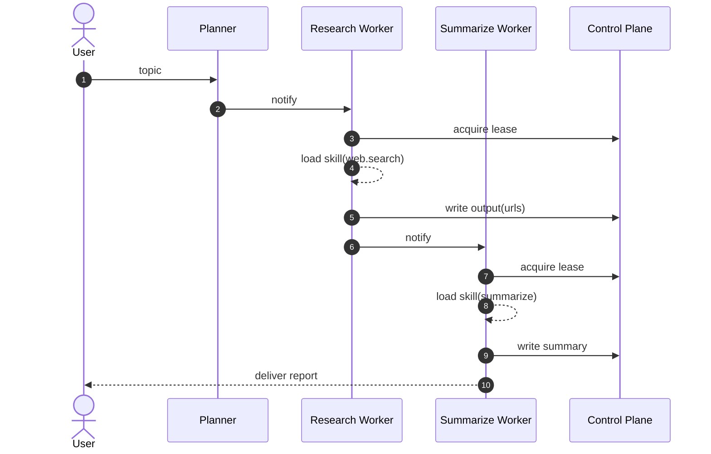

## Toward Self‑Evolving Agentic AI: A Unified Architecture for Skill‑Based Workflows and Hybrid Memory

**Author:** Lu Fan  
**Organization:** Selina Finance Ltd.  
**Date:** October 2025

---

### Abstract

This whitepaper proposes a practical, end‑to‑end architecture for **Agentic AI** that learns and improves over time. It unifies: (1) a **Dynamic Capability Framework (DCF)** for packaging and hot‑loading reusable skills; (2) a **Hybrid Memory System** combining a knowledge graph, hierarchical memory blocks, and a vector store; and (3) a **workflow runtime** that executes JSON‑defined SOPs via ephemeral, choreography‑driven worker agents. We detail schemas, control‑plane/data‑plane contracts, retrieval/learning loops, and promotion of validated SOPs, and we document an implementation centered on **Python tooling** with Letta/MemGPT, Graphiti/Neo4j, and Chroma.

---

## 1. Executive Summary

Most LLM agents can reason but struggle to **remember**, **generalize**, and **improve** operationally. They repeat mistakes, fail to turn success patterns into reusable procedures, and do not manage capabilities as first‑class, auditable artifacts. We address these gaps with:

- **Skills as portable modules** (manifests with tools, data sources, directives, and tests).  
- **Workflows as JSON SOPs** (AWS Step Functions–style state machines with agent bindings).  
- **Hybrid Memory** to ground planning in history (episodic), structure (graph), and content (vector).  
- **Policy + Reflection loops** to convert experience into **validated, versioned SOPs** and improve tool/strategy selection.

The result is a **self‑evolving system** where each run increases organizational intelligence.

---

## 2. Background & Motivation

### 2.1 Limits of Stateless, Agent‑Centric Designs
Traditional frameworks compose “teams of experts” (Planner, Coder, QA). They are typically **stateless**, re‑hydrating a conversation thread on each turn and discarding it afterward. This fragments knowledge, inflates context windows, and prevents long‑horizon learning.



### 2.2 Stateful, Memory‑Centric Agents
We instead treat the agent like a **long‑running process** with **tiered memory** and **virtual context management**—paging in the most relevant pieces of working/archival memory for each decision.

```mermaid
graph TD
    A[User msg → agent_id]
    B[Agent Orchestrator]
    C[Virtual Context Manager]
    D1[Working Memory]
    D2[Archival Memory (Vector)]
    E[LLM]
    A-->B-->C
    C-->D1
    C-->D2
    C-->|synthesized prompt|E
    E-->|outcome|B
    B-->|update|D1
    B-->|append|D2
```

**Remaining gap:** memory alone doesn’t expand what an agent can **do**. We need runtime‑acquired **capabilities**.

---

## 3. Dynamic Capability Framework (DCF)

### 3.1 Modularity Shift: from “Agents” to “Skills”
Agents are fungible shells that **load/unload skills** at runtime. A **skill** is an artifact (JSON manifest) that defines capabilities, tools/APIs, prompts/directives, dependencies, and embedded tests.

### 3.2 Skill Manifest (essentials)
- **Metadata:** name, version (semver), description, tags.  
- **Directives/Prompts:** guidance for correct tool use and guardrails.  
- **Tools:** schemas for MCP/API calls (args/result), rate limits, error mapping.  
- **Data sources:** RAG indices, graph labels, etc.  
- **Permissions:** egress policy, secrets required.  
- **Tests/fixtures:** regression cases to validate cross‑model.

### 3.3 Runtime Loading & Unloading
- **Load:** validate manifest → resolve dependencies → register tools/prompts with the agent.  
- **Unload:** remove to avoid collisions, reduce cognitive load, and minimize prompt size (“cognitive GC”).

### 3.4 DCF Loop (capability gap closure)
1) Analyze task & current skills → detect gap.  
2) Discover skills from a repository (semantic search + tags).  
3) Load skill; re‑synthesize prompt.  
4) Execute; record skill/version with outcome.  
5) Persist to memory for future retrieval.



**Why this matters:** It turns experience into **portable, auditable capability**.

---

## 4. Hybrid Memory System

A single store cannot satisfy all needs. We combine three modalities:

1) **Episodic Diary (Letta/MemGPT)** — chronological trace + reflective notes; great for continuity.  
2) **Knowledge Graph (Graphiti/Neo4j)** — entities/relations with **performance statistics** (e.g., `p_success`, `p95_latency`, `n`), enabling multi‑hop reasoning and governance.  
3) **Vector Store (Chroma/pgvector/etc.)** — dense retrieval for SOPs, lessons, docs, and long notes.

### 4.1 Architecture


### 4.2 Method (Triangulated Retrieval + Salience‑Gated Writes)
- **Plan‑time retrieval:** top‑k vectors + graph strategies/failure modes + recent diary snippets → **retrieval bundle** for the Planner.  
- **Finish‑time writes:** append experience; write to vector/graph/diary **only if novel or performance‑relevant**.

---

## 5. Workflows & Skills Runtime (Letta–ASL + Choreography)

### 5.1 Schemas (Contracts)
- `schemas/letta-asl-workflow-2.2.0.json` — workflow JSON (ASL subset + Letta bindings).  
- `schemas/skill-manifest-v2.0.0.json` — skill manifests (capabilities, tools, permissions).  
- Control/Data plane specs for orchestration:  
  - `control-plane-meta-v1.0.0.json` (workflow metadata, state deps, agent map)  
  - `control-plane-state-v1.0.0.json` (per‑state status, attempts, lease)  
  - `notification-payload-v1.0.0.json`, `data-plane-output-v1.0.0.json`

### 5.2 Planner → ASL
1) Converse to collect intent, constraints, budgets.  
2) Discover candidate skills (optionally querying a KG catalog).  
3) Draft linear SOP → compile to **ASL** with `StartAt`, `States`, `AgentBinding` per Task (agent template + skills).  
4) Validate via `validate_workflow(...)` with import resolution.

### 5.3 Ephemeral Workers & Choreography (RedisJSON)
- Workers are short‑lived Letta agents instantiated from a shared **.af v2 template**.  
- **Control plane:** per‑workflow `meta` + per‑state docs; **Data plane:** per‑state outputs.  
- **Leases:** optimistic concurrency with token + TTL; renew on long tasks.  
- **Notify:** downstream workers when upstream `done`.

**State doc (conceptual):**
```jsonc
{
  "state": "Research",
  "status": "pending|running|done|failed|cancelled",
  "attempts": 0,
  "lease": { "token": null, "owner_agent_id": null, "ttl_s": 300 },
  "started_at": null,
  "finished_at": null,
  "errors": []
}
```

### 5.4 Example Workflow (Research → Summarize)


### 5.5 Tooling (Python)
**Planning tools:** `validate_workflow`, `validate_skill_manifest`, `get_skillset`, `load_skill`, `unload_skill`  
**Execution tools:** `create_workflow_control_plane`, `create_worker_agents`, `read/update_control_plane`, `acquire/renew/release_state_lease`, `notify_next_worker_agent`, `notify_if_ready`, `finalize_workflow`  
**Testing tools:** `csv_to_manifests`, `csv_to_stub_config`

---

## 6. Self‑Evolving Control: Policy, SOPs, and Reflection

### 6.1 Components
- **Policy Service:** online **contextual bandit** for `(tool, strategy)` selection; offline ranker for stability.  
- **SOP Registry:** versioned, parameterized procedures with pre/postconditions, budgets, tests, and evidence.  
- **Reflector:** synthesizes lessons from runs, nominates SOP candidates.  
- **Evaluator:** off‑policy evaluation, drift/regression checks, dashboards.  
- **Guardrails:** PII, budgets, compliance, permission scopes.

### 6.2 Data Models (Illustrative)
**Experience tuple:** run/task/steps, context features, per‑step metrics (success, cost, latency), final reward.  
**SOP schema:** `id`, `version`, `owners`, `preconditions`, `steps` (tools + params), `budget`, `postconditions`, `evidence`, `tests`, `status`.

### 6.3 Learning Algorithms
- **Triangulated Retrieval:** (vector + graph + diary) → retrieval bundle for planning.  
- **Contextual Bandit:** rank `(tool, strategy)` by expected reward (success − α·latency − β·cost + γ·CSAT).  
- **Promotion Rules:** deduplicate lessons; promote to SOP on significant uplift (min N, p‑value threshold, no recent critical incidents).

---

## 7. Governance, Observability, and Safety

- **Provenance:** link outputs to `(run_id, plan_id, sop_id, skill_versions)`.  
- **Guardrails at ingress & tool boundary:** redact PII, enforce spend/latency ceilings, permission scopes.  
- **Resilience:** idempotency keys, circuit breakers, jittered retries, budget‑aware fallback paths.  
- **A/B Router:** safe rollout of new SOPs/policies; auto‑rollback on regression.

---

## 8. Implementation Status (Current)

- **Primary language & tooling:** **Python** for planning, runtime tooling, CSV‑to‑manifest generation, and stub MCP server.  
- **Agent framework:** Letta/MemGPT for hierarchical memory & agent shells.  
- **Graph:** Graphiti over Neo4j (entities, performance edges, SOP links).  
- **Vector:** Chroma (or pgvector) with metadata filters.  
- **Orchestration:** RedisJSON control plane for choreography and leases; Docker Compose for local dev; stub MCP for end‑to‑end tests.  
- **Note on prior drafts:** Some earlier design notes explored Java/Spring services; the **current working codebase is Python‑first**.

---

## 9. KPIs & Benefits

- **Success rate**, **p95 latency**, **cost per task**.  
- **SOP coverage** and **time‑to‑first‑success** on novel tasks.  
- **Repeat error rate** by error class; **exploration rate** trend.  
- **Explainability & audit** via SOPs/skill manifests and graph edges.

**Business impact:** continuous improvement, lower variance, faster onboarding (skills/SOPs are transferable), and vendor/model agility.

---

## 10. Roadmap & Extensions

- **Skill discovery UX:** human‑in‑the‑loop curation and trust signals.  
- **Cross‑agent knowledge sync:** publish/subscribe for SOP/skill updates.  
- **Policy distillation:** compress bandit logs into robust rankers per task cluster.  
- **Typed data contracts:** stronger validators, schema evolution.  
- **Multimodal artifacts:** index images/audio with vector store; align with graph entities.

---

## Appendix A — Example Workflow Snippet (ASL + AgentBinding)
```jsonc
{
  "workflow_id": "...",
  "workflow_name": "Research & Summarize",
  "version": "1.0.0",
  "af_imports": ["file://af/agent_templates.json"],
  "skill_imports": [
    "file://skills/web.search.json",
    "file://skills/summarize.json"
  ],
  "asl": {
    "StartAt": "Research",
    "States": {
      "Research": {
        "Type": "Task",
        "Parameters": {"query.$": "$.topic"},
        "ResultPath": "$.research",
        "AgentBinding": {
          "agent_template_ref": "agent_template_worker@1.0.0",
          "skills": ["skill://web.search@1.0.0"]
        },
        "Next": "Summarize"
      },
      "Summarize": {
        "Type": "Task",
        "Parameters": {
          "max_words": 200,
          "sources.$": "$.research.urls"
        },
        "ResultPath": "$.summary",
        "AgentBinding": {
          "agent_template_ref": "agent_template_worker@1.0.0",
          "skills": ["skill://summarize@1.0.0"]
        },
        "End": true
      }
    }
  }
}
```

## Appendix B — Example Skill Manifest (Essentials)
```jsonc
{
  "manifestId": "web.search@1.0.0",
  "name": "web.search",
  "version": "1.0.0",
  "tags": ["search", "research"],
  "permissions": {"egress": "internet", "secrets": []},
  "directives": "Prefer high‑quality sources; rate‑limit queries; deduplicate URLs.",
  "requiredTools": [
    {
      "name": "web_search",
      "serverId": "web.search.svc",
      "transport": "websocket",
      "args_schema": {"type": "object", "properties": {"q": {"type": "string"}}}
    }
  ],
  "tests": [{"input": {"q": "test"}, "expect": {"ok": true}}]
}
```

---

**End of whitepaper.**
