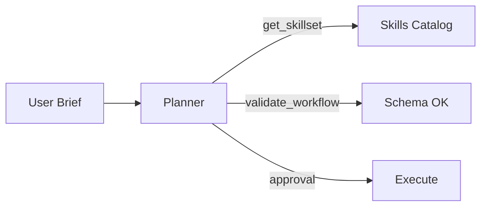
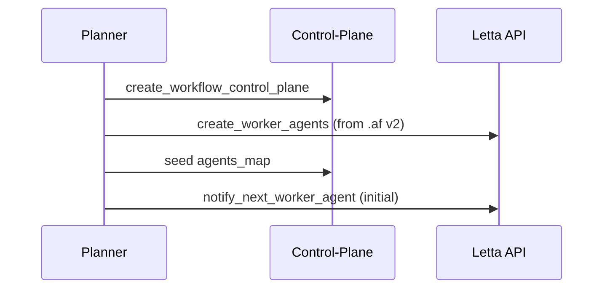
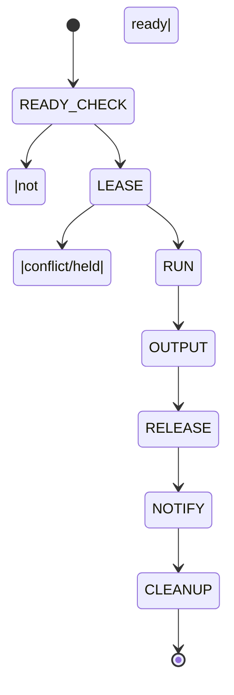

# End-to-End Testing Plan — Letta + ASL Workflows + Skill-Oriented Development

This guide walks a new contributor through **planning, validating, and executing** a multi-step workflow using:
- CSV-defined **skills** and **MCP tool stubs**
- A **stub MCP server** running in Docker
- Our **Letta-friendly Python tools** for control/data-plane and orchestration
- The **Planner** and **Worker** agent personas

It both **validates correctness** and serves as a **tutorial**.

---

## 0) Scope of the Scenario

### Problem to Solve (Illustrative)
**“Competitive Landscape Research → Strategy Brief → Stakeholder Email”**

A product manager wants a short strategy brief comparing two competitors on a new feature area (e.g., **offline collaboration**) and an executive-ready email summary. The workflow must:
1. **Research** each competitor (collect facts & signals) — multiple sources.
2. **Synthesize** into a structured comparison table (KPIs + qualitative signals).
3. **Draft** a 1-page strategy brief with recommendations.
4. **Produce** an exec-facing email (TL;DR + call to action).
5. **Finalize** artifacts.

Each step uses skill manifests which, for testing, are backed by a **stub MCP server**. The same workflow can later be run with **real MCP servers** by swapping endpoints via the loader’s resolver.

---

## 1) Prerequisites

- Docker + Docker Compose
- A running Letta server (per your compose file)
- The repo folder with these paths (or equivalent):
  - `tools/` — Letta-friendly Python tools
  - `skills_src/` — CSVs and generated manifests
  - `skills/` — generated skill manifests
  - `generated/stub/` — generated stub config
  - `schemas/` — (workflow, skill manifest, control/data-plane)
  - `docker/stub-mcp/` — minimal MCP server container
- Env vars (typical defaults):
  - `LETTA_BASE_URL=http://localhost:8283`
  - `REDIS_URL=redis://localhost:6379/0` (only if you use Redis for other tests)
  - For CSV → manifests generation you **do not** need Redis.

> Tip: If you use a different folder layout, adjust commands accordingly.

---

## 2) Prepare Skills and Tool Stubs from CSV

We use **two CSVs** to describe skills and MCP tools. Then we generate:
- **Skill manifests** into `skills/`
- A **registry** (`skills_src/registry.json`) mapping logical MCP server IDs
- A **stub config** (`generated/stub/stub_config.json`) used by the stub MCP server

### 2.1 Create CSVs

Create two files under `skills_src/`:

**`skills_src/skills.csv`**
```
manifestId,skillName,skillVersion,description,tags,egress,secrets,serverId,toolNames,directives
compresearch.v1,competitor_research,1.0.0,Collect facts on competitors,"research,web","none","",mcp://stub.research,"web.search|web.scrape|summarize",Focus on accuracy and cite sources where possible.
synthesis.v1,competitive_synthesis,1.0.0,Turn raw facts into a comparison table,"analysis,table","none","",mcp://stub.analysis,"extract.entities|tabulate|merge",Normalize metrics and highlight deltas.
brief.v1,strategy_brief,1.0.0,Draft strategy recommendations,"writing,brief","none","",mcp://stub.writing,"outline|draft|refine",Executive tone; keep it to ~1 page.
email.v1,exec_email,1.0.0,Create an exec-facing summary email,"writing,email","none","",mcp://stub.writing,"email.compose",Short, with TL;DR and clear asks.
```

**`skills_src/tools.csv`**
```
serverId,transport,endpoint,toolName,description,input_schema,output_schema,behavior,case_key,case_input,case_output
mcp://stub.research,websocket,ws://stub-mcp:8765,web.search,Return search snippets,{"query":"string"},{"results":"array"},"table",query,"offline collaboration",{"results":[{"title":"Blog A","snippet":"Company A ships offline mode."},{"title":"Blog B","snippet":"Company B beta offline collab."}]}
mcp://stub.research,websocket,ws://stub-mcp:8765,web.scrape,Return page facts,{"url":"string"},{"facts":"array"},"table",url,"https://example.com/a",{"facts":["A supports local-first sync","A mobile offline OK"]}
mcp://stub.research,websocket,ws://stub-mcp:8765,summarize,Summarize facts,{"items":"array"},{"summary":"string"},"table",items,'["A supports local-first","B beta"]',{"summary":"A is GA, B is beta; A stronger on mobile."}
mcp://stub.analysis,websocket,ws://stub-mcp:8765,extract.entities,Extract KPIs,{"text":"string"},{"entities":"array"},"table",text,"A vs B offline","{\"entities\":[\"launch_status\",\"mobile_support\"]}"
mcp://stub.analysis,websocket,ws://stub-mcp:8765,tabulate,Make a table,{"rows":"array"},{"table":"array"},"table",rows,"[{\"kpi\":\"launch_status\",\"A\":\"GA\",\"B\":\"beta\"}]",{"table":[{"kpi":"launch_status","A":"GA","B":"beta"}]}
mcp://stub.analysis,websocket,ws://stub-mcp:8765,merge,Merge tables,{"tables":"array"},{"table":"array"},"table",tables,"[[{\"kpi\":\"launch_status\",\"A\":\"GA\",\"B\":\"beta\"}],[]]",{"table":[{"kpi":"launch_status","A":"GA","B":"beta"}]}
mcp://stub.writing,websocket,ws://stub-mcp:8765,outline,Create a brief outline,{"topic":"string"},{"outline":"array"},"table",topic,"Offline collaboration",{"outline":["Context","Findings","Recommendation"]}
mcp://stub.writing,websocket,ws://stub-mcp:8765,draft,Expand outline,{"outline":"array","table":"array"},{"doc":"string"},"table",outline,"[\"Context\",\"Findings\",\"Recommendation\"]",{"doc":"1-pg brief text with deltas and recs."}
mcp://stub.writing,websocket,ws://stub-mcp:8765,refine,Refine draft,{"doc":"string"},{"doc":"string"},"table",doc,"1-pg brief text",{"doc":"Final brief ready."}
mcp://stub.writing,websocket,ws://stub-mcp:8765,email.compose,Compose email,{"summary":"string"},{"email":"string"},"table",summary,"A is GA; B beta. Recommend trial.",{"email":"Subject: Offline collab\nTL;DR ..."} 
```

> **Note:** `input_schema`/`output_schema` accept simple JSON objects; `behavior="table"` means the stub will use the `case_key`, `case_input` and `case_output` to match requests.

### 2.2 Generate Manifests + Stub Config

Use the Letta-friendly tools (they accept raw strings).

```bash
# Generate manifests + registry.json
python tools/csv_to_manifests.py \
  --skills_csv skills_src/skills.csv \
  --out_dir skills/ \
  --registry_out skills_src/registry.json

# Generate stub server config
python tools/csv_to_stub_config.py \
  --tools_csv skills_src/tools.csv \
  --out_json generated/stub/stub_config.json
```

**Expected result**
- `skills/*.json` files (one per skill) conforming to `v2.0.0`
- `skills_src/registry.json` with `serverId → transport/endpoint` mapping
- `generated/stub/stub_config.json` with per-tool stub rules

---

## 3) Run the Stub MCP Server (Docker)

We provide a minimal container in `docker/stub-mcp/` (WS endpoint: `ws://stub-mcp:8765`).

```bash
docker compose up -d stub-mcp
# verify logs
docker compose logs -f stub-mcp
```

**What it does**
- Serves the tools declared in `generated/stub/stub_config.json`
- Responds deterministically based on CSV definitions

---

## 4) Prime the Planner and Worker Agents

Use the **system prompts** you prepared:
- **Planner**: role, success criteria, choreography steps, attached tools
- **Worker**: event handling, lease lifecycle, skills loading/unloading, output writing, notify downstream

Attach the following **Python tools** to Planner:
- `validate_workflow`, `validate_skill_manifest`, `get_skillset`
- `create_workflow_control_plane`, `create_worker_agents`
- `notify_next_worker_agent`, `notify_if_ready`
- `read_workflow_control_plane`, `finalize_workflow`

Attach to Worker:
- `read_workflow_control_plane`, `acquire_state_lease`, `renew_state_lease`, `release_state_lease`, `update_workflow_control_plane`
- `notify_next_worker_agent`, `notify_if_ready`
- `get_skillset`, `load_skill`, `unload_skill`

> Ensure your **load_skill** tool reads `skills_src/registry.json` to resolve `serverId → endpoint` (logical IDs).

---

## 5) Conversational Planning (Human ↔ Planner)

### 5.1 User Brief
> “I need a strategy brief comparing **Competitor A** vs **Competitor B** on **offline collaboration**, and an exec email.”

### 5.2 Planner Actions (expected)
1. Ask clarifying Qs (scope, length, tone, competitors, due date).
2. Discover skills:
   - `get_skillset(manifests_dir="skills/", include_previews=true)`
3. Draft a **Letta–ASL** workflow (v2.2.0), e.g.:

```json
{
  "workflow_id": "b9f4b88d-9a5d-4b95-bb5f-1bcbc2cb9f3a",
  "workflow_name": "offline-collab-brief",
  "version": "1.0.0",
  "af_imports": [ { "uri": "file://af/agent_templates.json" } ],
  "skill_imports": [
    { "uri": "file://skills/competitor_research.json" },
    { "uri": "file://skills/competitive_synthesis.json" },
    { "uri": "file://skills/strategy_brief.json" },
    { "uri": "file://skills/exec_email.json" }
  ],
  "asl": {
    "StartAt": "Research",
    "States": {
      "Research": {
        "Type": "Task",
        "AgentBinding": {
          "agent_ref": { "name": "generic_worker_v2" },
          "skills": ["competitor_research@1.0.0"]
        },
        "Next": "Synthesize"
      },
      "Synthesize": {
        "Type": "Task",
        "AgentBinding": {
          "agent_ref": { "name": "generic_worker_v2" },
          "skills": ["competitive_synthesis@1.0.0"]
        },
        "Next": "Brief"
      },
      "Brief": {
        "Type": "Task",
        "AgentBinding": {
          "agent_ref": { "name": "generic_worker_v2" },
          "skills": ["strategy_brief@1.0.0"]
        },
        "Next": "ExecEmail"
      },
      "ExecEmail": {
        "Type": "Task",
        "AgentBinding": {
          "agent_ref": { "name": "generic_worker_v2" },
          "skills": ["exec_email@1.0.0"]
        },
        "End": true
      }
    }
  }
}
```

4. Validate:
   - `validate_workflow(...)` → `exit_code == 0`
5. Ask for approval to execute.

**Mermaid — High Level Flow**


---

## 6) Launch the Workflow (Planner)

With user approval, Planner should execute the choreography:

1. **Control-plane:**  
   `create_workflow_control_plane(workflow_json=..., agents_map_json=None)`

2. **Workers:**  
   `create_worker_agents(workflow_json=..., imports_base_dir=".", agent_name_prefix="wf-${id}-")`  
   Store returned `agents_map` into the meta:
   `create_workflow_control_plane(..., agents_map_json=<from step above>)`

3. **Kickoff (source states)**:  
   `notify_next_worker_agent(workflow_id, source_state=None, reason="initial", async_message=True)`

**Mermaid — Orchestration**


---

## 7) Worker Execution (per state)

Each Worker receives a `workflow_event` message and follows its **deterministic loop**:

1. `read_workflow_control_plane(..., states_json=["<self>"], compute_readiness=true)`
2. `acquire_state_lease(..., set_running_on_acquire=true)`
3. Load skills: `load_skill(skill_json, agent_id=<self>)` (resolver maps `serverId`)
4. Call MCP tools via the loaded skill(s): the **stub MCP server** returns deterministic results.
5. Write output & status:
   `update_workflow_control_plane(new_status="done", output_json=...)`
6. Release lease: `release_state_lease(...)`
7. Notify downstream: `notify_next_worker_agent(source_state=<self>, async_message=true)`
8. Unload skills: `unload_skill(...)`

**Mermaid — State machine**


---

## 8) Verify Data Plane Outputs

As each state completes, inspect (via tools or Redis CLI if used):
- `dp:wf:<id>:output:Research` → facts + summary
- `dp:wf:<id>:output:Synthesize` → comparison table
- `dp:wf:<id>:output:Brief` → ~1 page doc text
- `dp:wf:<id>:output:ExecEmail` → email text

> With the stub server, these are **deterministic** (match `tools.csv` behavior).

---

## 9) Finalization

When terminal state(s) finish, Planner runs:
- `finalize_workflow(workflow_id, delete_worker_agents=true, preserve_planner=true, close_open_states=true, finalize_note="E2E test")`

**Checks**
- Meta updated with `status` (e.g., `succeeded`) and `finalized_at`
- Worker agents deleted (except planner if preserved)
- Audit record written (if enabled by your tools)

---

## 10) Acceptance Criteria (Technical & Functional)

### Technical
- All tools return `exit_code==0` or `"error": null` on the happy path.
- RedisJSON control-plane has one meta and N state docs.
- Worker lease lifecycle is correct (acquire → renew → release).
- Async notifications reach the right agents (message logs show receipts).
- Outputs present for each state; sizes within guidelines.

### Functional
- The **brief** includes a coherent narrative with the comparison deltas.
- The **email** contains TL;DR and a clear next action.
- End-to-end run is reproducible using the stub server (same outputs).

---

## 11) Troubleshooting

- **Manifests not found**: ensure `skills/` contains generated JSON files; rerun `csv_to_manifests.py`.
- **MCP server unreachable**: check compose (`docker compose ps`) and endpoint in `skills_src/registry.json`.
- **Lease conflicts**: workers may have been double-notified; verify `notify_next_worker_agent` readiness filter.
- **Validation fails**: run `validate_skill_manifest` for each skill and fix schema errors.
- **Missing outputs**: confirm worker wrote `update_workflow_control_plane(..., output_json=...)` before releasing lease.

---

## 12) Stretch Tests

- **Parallel Research**: fork the `Research` state into `ResearchA` and `ResearchB` with a `Parallel` or two `Task`s feeding `Synthesize` (readiness gate ensures both finish first).
- **Retry Policy**: inject a stub tool that fails once (behavior=`counter`, threshold=1) to validate Worker retry logic.
- **Real MCP Swap**: modify `skills_src/registry.json` to point `mcp://stub.research` at a real service and re-run.

---

## 13) Clean Up

- `finalize_workflow(...)`
- `docker compose down stub-mcp`
- Optional: remove `skills/` and `generated/stub/` to rebuild from scratch next time.

---

## Appendix A — Example Minimal Workflow (ASL)

```json
{
  "workflow_id": "b9f4b88d-9a5d-4b95-bb5f-1bcbc2cb9f3a",
  "workflow_name": "offline-collab-brief",
  "version": "1.0.0",
  "skill_imports": [
    { "uri": "file://skills/competitor_research.json" },
    { "uri": "file://skills/competitive_synthesis.json" },
    { "uri": "file://skills/strategy_brief.json" },
    { "uri": "file://skills/exec_email.json" }
  ],
  "asl": {
    "StartAt": "Research",
    "States": {
      "Research": {
        "Type": "Task",
        "AgentBinding": {
          "agent_ref": { "name": "generic_worker_v2" },
          "skills": ["competitor_research@1.0.0"]
        },
        "Next": "Synthesize"
      },
      "Synthesize": {
        "Type": "Task",
        "AgentBinding": {
          "agent_ref": { "name": "generic_worker_v2" },
          "skills": ["competitive_synthesis@1.0.0"]
        },
        "Next": "Brief"
      },
      "Brief": {
        "Type": "Task",
        "AgentBinding": {
          "agent_ref": { "name": "generic_worker_v2" },
          "skills": ["strategy_brief@1.0.0"]
        },
        "Next": "ExecEmail"
      },
      "ExecEmail": {
        "Type": "Task",
        "AgentBinding": {
          "agent_ref": { "name": "generic_worker_v2" },
          "skills": ["exec_email@1.0.0"]
        },
        "End": true
      }
    }
  }
}
```

---

## Appendix B — Quick Command Cheatsheet

```bash
# 1) Generate manifests and stub config
python tools/csv_to_manifests.py --skills_csv skills_src/skills.csv --out_dir skills/ --registry_out skills_src/registry.json
python tools/csv_to_stub_config.py --tools_csv skills_src/tools.csv --out_json generated/stub/stub_config.json

# 2) Start stub MCP server
docker compose up -d stub-mcp

# 3) (Planner_Combined.md) Validate workflow
# -> call validate_workflow(workflow_json=..., schema_path=schemas/letta-asl-workflow-2.2.0.json)

# 4) (Planner_Combined.md) Create control-plane + workers + kickoff
# -> create_workflow_control_plane(...)
# -> create_worker_agents(...)
# -> create_workflow_control_plane(..., agents_map_json=...)
# -> notify_next_worker_agent(..., source_state=None, async_message=True)

# 5) (Workers) Execute automatically on notifications

# 6) (Planner_Combined.md) Finalize
# -> finalize_workflow(...)
```

Happy testing!
